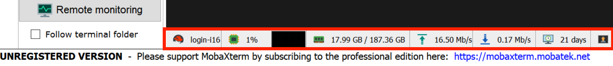

.. _acceptable use:

Acceptable use
==============

Cluster is a shared resource, at any given time there can be hundreds users
and thousands of jobs running.  What you do can have dramatic effects on others.

Access to all RCIC managed resources is subject to our
`Acceptable Use Policy </_static/RCIC-Acceptable-Use-Policy.pdf>`_.
Please read and abide by it.

.. important::

   Violations of this policy or any other applicable University policies may result
   in the temporary or permanent removal of accounts associated with research computing.

To avoid problems, please follow simple rules of conduct described below. 

.. _conduct rules:

Simple conduct 
--------------

* **All jobs, batch or interactive must be submitted to the Slurm scheduler**
* **Login nodes are meant only for**:

  1. Light editing
  2. Very short compilation (under a few minutes and using  one thread)
  3. Submitting jobs

  :red:`Do not run on login node:`

  * **any computational jobs** 
  * **any job that runs for more than 1hr or is using significant memory and CPU**
  * **any compilation** that asks for multiple threads while running make
    (for example ``make -j 8``) 
  * **any conda or R installation** of packages or environments
  * **any downloads** of packages, data, large files that exceed a few Gbs.

  The above (and additional similar) processes need to be submitted to the Slurm
  scheduler as :ref:`interactive or batch jobs <jobs>`.

  .. warning::

     | :red:`Long-running jobs will be removed from login nodes without notice`
     | :red:`We reserve the right to limit access for the users who abuse the system`

* **Ssh access to the compute nodes is turned off** to prevent users from starting
  jobs bypassing Slurm.  See :ref:`attach to job`.

* **Do not run Slurm jobs in your** :tt:`$HOME`. Instead, use your DFS storage :tt:`/pub/UCInetID`.

* **Check your disk quota frequently**. File system limits are generally the first
  ones that will negatively affect your job. See :ref:`home`, :ref:`dfs` and
  :ref:`crsp` pages for information about quotas. 

.. _special cases:

Special cases
-------------

.. _mobaxterm monitoring:

MobaXterm monitoring
^^^^^^^^^^^^^^^^^^^^

:red:`MobaXterm users DO NOT enable remote server monitoring!`

Remote server monitoring is an experimental feature of MobaXterm that runs 
unnecessary multiple processes on login node under your account.
These processes add to the overall load on the cluster.
**None of the information they collect you can use in any way for your work** on the cluster.

Do check the lower portion of your MobaXterm window to verify that your
monitoring is disabled. See figures below for a reference:

   :red:`Monitoring enabled - WRONG!`

   Monitoring disabled - correct!
