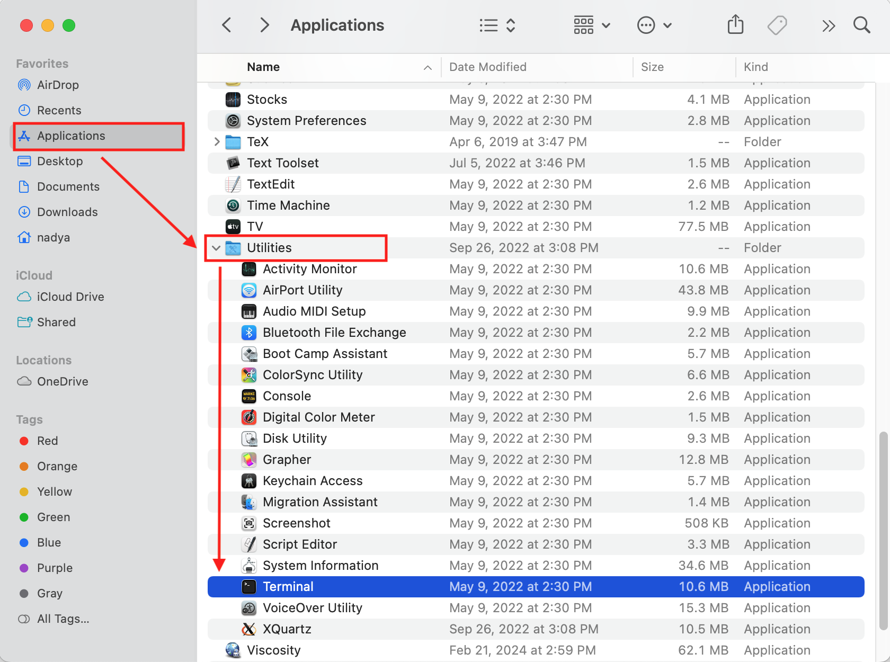

:orphan:

.. _generate ssh keys:

Generate SSH keys
=================

We provide info here how to generate SSH keys on different laptops
and to copy a public key to your account on the HPC3 cluster.

.. contents::
   :local:

.. _generate-ssh-keys-mac:

Generate SSH keys on macOS
--------------------------

We assume your ``ssh`` is from OpenSSH, for other ssh distributions please
use your specific software instructions.

1. Open your :tt:`Terminal` application

2. In the Terminal window check your ssh software is OpenSSH

   .. parsed-literal::

      :blue:`ssh -V`
      OpenSSH_8.6p1, LibreSSL 3.3.6
   
   The output shows **OpenSSH**, your version may differ depending on your
   installed ssh.

3. Create ssh keys 

   To create the keys, one needs to choose:

   - **name** for ssh keys files; this needs to be a single word with no spaces
   - **comment**  to add to the key; use your UCINetID
   - **very strong passphrase** must be used for protecting your SSH key;
     it can contain spaces, numbers and special characters and must be at least 10
     characters long. :red:`WARNING: Do not use empty passphrase!`

   In the following example we use the following choices:

   :name: key-to-hpc3
   :comment:  "panteater\@uci.edu (MacBook Air)"
   :passphrase:  you need to type it twice when prompted

   Execute the ``ssh-keygen`` command to create ssh keys:

   .. parsed-literal::

      :blue:`ssh-keygen -t rsa -f  ~/.ssh/key-to-hpc3 -C "panteater@uci.edu (MacBook Air)"`
      Generating public/private rsa key pair.
      Created directory '/Users/panteater/.ssh'.
      Enter passphrase (empty for no passphrase):
      Enter same passphrase again:
      Your identification has been saved in /Users/panteater/.ssh/key-to-hpc3
      Your public key has been saved in /Users/panteater/.ssh/key-to-hpc3.pub
      The key fingerprint is:
      SHA256:KLY8s4Aq1JBrD8pCitYkn7MbZjUu6FOyUzgyuOevSuk panteater@uci.edu (MacBook Air)
      The key's randomart image is:
      +---[RSA 3072]----+
      \|*=T=.            |
      \|*.o*.            |
      \|=.1.  o          |
      \|== o + .         |
      \|B.X * o S        |
      \|=E B o o o       |
      \|=.  o . .        |
      \|.+oo             |
      \|==. .            |
      +----[SHA256]-----+

   The above command will add a :tt:`.ssh` directory (directory is another name for folder)
   in your :tt:`$HOME` directory and generate two files there: a private key :tt:`key-to-hpc3`
   and a public key :tt:`key-to-hpc3.pub`. They are always generated and work as a pair. 

   .. attention:: | Private key should NEVER be shared. It remains on your laptop.
                  | Alwyas use a non-empty passphrase for your key and remember it!

   Check your ssh keys. The first command simply lists the contents of your
   :tt:`.ssh/` directory, and the second prints  the contents of your public
   ssh key:

   .. parsed-literal::

      :blue:`ls ~/.ssh`
      key-to-hpc3     key-to-hpc3.pub

      :blue:`cat ~/.ssh/key-to-hpc3.pub`
      ssh-rsa AAAA1yc2Ew...characters deleted...97VU0yRlaTxEX= panteater\@uci.edu (MacBook Air)

.. _generate PEM-formatted keys:

3. PEM-formatted keys

   PEM-formatted keys are the most reliable format for the :ref:`CRSP Desktop Client <crsp clients>`. The procedure is essentially identical
   to the previous step but adds an explicit format and the :tt:`.pem` file extension. 

   **Replace**

   .. parsed-literal::

     :blue:`ssh-keygen -t rsa -f  ~/.ssh/key-to-hpc3 -C "panteater@uci.edu (MacBook Air)"`

   **With**

   .. parsed-literal::
   
     :blue:`ssh-keygen -t rsa -f  ~/.ssh/key-to-hpc3.pem -m PEM -C "panteater@uci.edu (MacBook Air)"`

   The above will create files :tt:`key-to-hpc3.pem` and :tt:`key-to-hpc3.pem.pub`

.. _copy ssh keys:

4. Transfer your public ssh key to HPC3

   .. attention::

      For windows, ``ssh-copy-id`` does not exist, utilize the method  
      :ref:`Copy ssh keys on Windows <copy-ssh-keys-windows>`

   Use ``ssh-copy-id`` command to copy your public key
   from your laptop to your account on HPC3.

   You will be prompted for the standard password and DUO authentication
   by this command. Use your UCINetID, here is an example session for user panteater:

   .. parsed-literal::

      :blue:`ssh-copy-id -i ~/.ssh/key-to-hpc3 panteater@hpc3.rcic.uci.edu`
      The authenticity of host 'hpc3.rcic.uci.edu (128.200.221.16)' can't be established.
      ED25519 key fingerprint is SHA256:KLY8s4Aq1JBrD8pCitYkn7MbZjUu6FOyUzgyuOevSuk.
      This key is not known by any other names
      Are you sure you want to continue connecting (yes/no/[fingerprint])?  :blue:`yes`
      /usr/bin/ssh-copy-id: INFO: attempting to log in with the new key(s), to filter out any that are already installed
      /usr/bin/ssh-copy-id: INFO: 1 key(s) remain to be installed -- if you are prompted now it is to install the new keys
      (panteater\@hpc3.rcic.uci.edu) Password:  :red:`type your UCInetID password`
      (panteater\@hpc3.rcic.uci.edu) Duo two-factor login for panteater

      Enter a passcode or select one of the following options:

       1. Duo Push to XXX-XXX-1234

      Passcode or option (1-1): :red:`type 1`

      Number of key(s) added:        1

      Now try logging into the machine, with:   "ssh panteater\@hpc3.rcic.uci.edu"
      and check to make sure that only the key(s) you wanted were added.

   The content of your public key will be added to :tt:`$HOME/.ssh/authorized_keys` file
   in your HPC3 account.

5. Create key mapping 

   This task is done once for generated ssh keys pair.

   Your ssh keys are stored in the default directory but they have
   non-default names. We need to add newly generated key's name to the ssh
   configuration file to let the ssh commands know what keys to use when
   connecting to HPC3 cluster.

   Create :tt:`~/.ssh/config` file with your choice of editor and add the following:

   .. parsed-literal::

      Host hpc3.rcic.uci.edu 
        IdentityFile ~/.ssh/key-to-hpc3

   The :tt:`~/ssh/config` is a user's ssh configuiration file that is used  by ssh commands.
   The added content tells ssh to use this specific ssh key when connecting to HPC3.

.. _generate-ssh-keys-linux:

Generate SSH keys on Linux
--------------------------

Follow the of the steps for :ref:`generating ssh keys on macOS <generate-ssh-keys-mac>`
except in the first step use any terminal application that is available on your laptop.

.. _generate-ssh-keys-windows-powershell:

Generate SSH keys on Windows in Powershell
------------------------------------------

Follow the of the steps for :ref:`generating ssh keys on macOS <generate-ssh-keys-mac>`
except in the first step use Powershell that is available on your laptop.
Once the keys are generated you will need to copy to the contents of your public key to HPC3.
See :ref:`copy-ssh-keys-windows` below.

.. _generate-ssh-keys-windows-putty:

Generate SSH keys on Windows with PuttyGen
------------------------------------------

`PuTTY <https://www.chiark.greenend.org.uk/~sgtatham/putty/latest.html>`_ is a very common terminal program used on 
Windows laptops and desktops.  Other software that can use key-based authentication can also use keys generated by 
PuTTYgen.   This tutorial assumes that you have downloaded and installed PuTTY, Pageant, PuTTYgen (using their MSI-based
installer is the simplest method)

1. Open PuTTYgen from the Windows Start Button to see the following screen and
   press the :guilabel:`Generate` button

   .. image:: images/puttygen-initial.png
      :align: center
      :width: 90%
      :alt: PuTTYgen start screen
      :class: addpadding

2. Assign a passphrase and save both the public and private key.   

   .. image:: images/puttygen-passphrase.png
      :align: center
      :width: 90%
      :alt: PuTTYgen assign passphrase and save
      :class: addpadding

   .. note::

      A reasonable pattern for your private key name :tt:`ucinetid-to-hpc3` and :tt:`ucinetid-to-hpc3.pub` for the public key. 
      replace *ucinetid* with your specific id, e.g., *panteater*.

   The private key file is of type *ppk* for PuTTY Private Key.
   The private key should remain on your laptop. 
   You will need to copy to the contents of your *public* key to HPC3. 
   See section :ref:`copy-ssh-keys-windows` below.

.. _copy-ssh-keys-windows:

Copy SSH Public Key From Windows to HPC3
-------------------------------------------

   Since Windows does not have the convenience of ``ssh-copy-id``, one has to type a bit more.  The following can be run 
   from either a Command window or a Powershell window to place the key :tt:`panteater-to-hpc3.pub` in the appropriate place.

   .. parsed-literal::

      C:\> :blue:`type .\\panteater-to-hpc.pub | ssh panteater@hpc3.rcic.uci.edu "cat >> .ssh/authorized_keys"`
      (panteater\@hpc3.rcic.uci.edu) Password: :red:`type your UCInetID password`
      (panteater\@hpc3.rcic.uci.edu) Duo two-factor login for panteater

      Enter a passcode or select one of the following options:
   
      1. Duo Push to XXX-XXX-1234
   
      Passcode or option (1-1): :red:`type 1`

      C:\>

      The content of your public key will be added to :tt:`$HOME/.ssh/authorized_keys` file
      in your HPC3 account.

.. _additional tutorials:

Additional tutorials
--------------------

See :ref:`tutorials` for additional SSH-related reading. 
