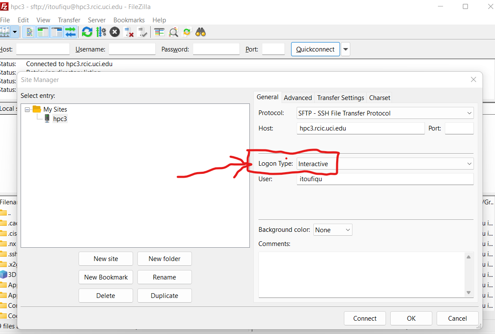
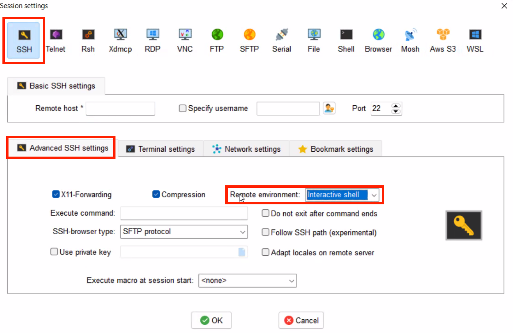

.. _login:

Logging in
==========

Please make sure you have enabled your DUO device using
`UCI’s Duo infrastructure <https://www.oit.uci.edu/services/accounts-passwords/duo/>`_

To connect to an HPC3 login node use:

:server name:
  :tt:`hpc3.rcic.uci.edu`
:login name: 
  your UCINetID
:password: 
  your password associated with your UCINetID

The following login methods are available, most common listed first:

.. contents::
   :local:

.. _ssh login:

Using ssh
---------

:term:`SSH` is the only way to directly log in to HPC3 for interactive use and 
we require multi-factor authentication for all password-based logins.

We describe two main methods below.

.. _ssh password duo:

Method I: Password authentication
^^^^^^^^^^^^^^^^^^^^^^^^^^^^^^^^^

**Password authentication with automated DUO push on your phone**
is the most common method for authentication. It requires your phone to have 
internet access to receive the push notification from DUO and to send your 
approval/denial back to DUO’s servers. 

You access HPC3 via your favorite SSH (SCP, SFTP) client from your laptop and then respond to the DUO app on your phone.
HPC3 prompts you for a password and requests to use  DUO authentication. The
DUO push happens on your phone (or your other DUO-enabled device).

**Step by Step**

- You must either be on the campus network or connected to the
  `UCI campus VPN <https://www.oit.uci.edu/help/vpn>`_.
- To use ssh, you need to use one of **Terminal** applications and depending on a
  user laptop they are listed in :ref:`laptop apps`.

1. **Run ssh command**

   Your login name can be specified as ether :tt:`user@hostname` or given with the :tt:`-l` option,
   for example a user with UCINetID *panteater* can use one of the following:

  .. code-block:: console

     ssh panteater@hpc3.rcic.uci.edu
     ssh hpc3.rcic.uci.edu -l panteater

  When prompted for a password please enter password followed by :guilabel:`Return` key.
  Note, password will not be visible when typed:

  .. code-block:: console

     Password:

2. **Respond do  multi-factor authentication prompts**

   Next, you will be prompted to enter a code (backup or generated by your DUO device)
   or request a push to your enrolled DUO-enabled device. A prompt looks similar to:

   .. code-block:: text

      Duo two-factor login for panteater

      Enter a passcode or select one of the following options:

       1. Duo Push to XXX-XXX-1234

      Passcode or option (1-1): 

   Type desired option (in this example *1*).

   .. code-block:: text
   
      Passcode or option (1-1): 1

3. **Use DUO on your phone**

   Now use the DUO app on your phone and respond to the received DUO
   notification. Press :guilabel:`Approve` on your DUO app when prompted.
   If the DUO authentication is successful you will see on your laptop:

   .. code-block:: text

      Success. Logging you in...
      Last login:  ....

After a successful login you will see a screen similar to the following:

.. code-block:: text

   +-----------------------------------------+
   |  _             _             _ _ ____   |
   | | | ___   __ _(_)_ __       (_) | ___|  |
   | | |/ _ \ / _` | | '_ \ _____| | |___ \  |
   | | | (_) | (_| | | | | |_____| | |___) | |
   | |_|\___/ \__, |_|_| |_|     |_|_|____/  |
   |          |___/                          |
   +-----------------------------------------+
    Distro:  Rocky 8.7 Green Obsidian
    Virtual: NO

    CPUs:    40
    RAM:     191.8GB
    BUILT:   2022-08-30 14:02

    ACCEPTABLE USE: https://rcic.uci.edu/documents/RCIC-Acceptable-Use-Policy.pdf

   [user@login-x:~]$

.. _ssh keys:

Method II: Key-based authentication
^^^^^^^^^^^^^^^^^^^^^^^^^^^^^^^^^^^

If you choose to use key-based authentication for your login, you have additional responsibilities:

.. attention:: 

   * **Every user-generated ssh key MUST have a non-empty passphrase**.
     It is a requirement per our :ref:`acceptable use` policy 
   * **NEVER add a different user's ssh public into your authorized_keys file**. This is a violation of account sharing. 
   * **Generate a different private key and password for each device you plan to use**
     for accessing HPC3.  For example, if you two different laptops, generate a private key for each laptop.
   * **Treat all of your ssh private keys with care**. If you are on a shared system (e.g. a lab workstation), make sure
     that file permissions are set such you (and only you) can read and unlock the key with its passphrase.
   * If you don't want to keep re-entering your passphrase, you should learn how to manage your ssh keys with the help of ssh agents.
     This provides a convenience of a "passwordless" ssh key, but has all the security of a password-protected key.

   See :ref:`tutorials` for more SSH links.

**Step by Step**

1. **Generate your ssh keys**

   This step is done once.  Depending on your laptop, use the following guides:

   :macOS:  :ref:`generate-ssh-keys-mac`
   :Linux:  :ref:`generate-ssh-keys-linux`
   :Windows (PuTTY): :ref:`generate-ssh-keys-windows-putty`
   :Windows (Powershell): :ref:`generate-ssh-keys-windows-powershell`

   Once you generate your SSH keys and copy the public key to HPC3

   | (a) your laptop or workstation from which you are initiating ssh will have 
   |     a *password protected* ssh private key and a corresponding public key.
   | (b) your public ssh key is copied to HPC3 in your :tt:`$HOME/.ssh/authorized_keys` file.

2. **Use ssh command to login**

   Once your keys are setup simply use ``ssh`` commands.
   For example a user with UCINetID *panteater* can use one of the following
   commands  and provide your ssh passphrase when prompted:

   .. code-block:: console

      ssh panteater@hpc3.rcic.uci.edu
      ssh hpc3.rcic.uci.edu -l panteater

   The above commands assume using default ssh keys (usually ~/.ssh/id_rsa,
   .ssh/id_dsa, ~/.ssh/id_ecdsa, ~/.ssh/id_ed25519, and ~/.ssh/identity).

   If your ssh keys have non-default names and you do not have mapping in your
   :tt:`~/.ssh/config` file, or if your ssh client does not use this file (FileZilla),
   then you need to specify ssh key via :tt:`-i` flag:

   .. code-block:: console

      ssh -i ~/.ssh/key-to-hpc3 panteater@hpc3.rcic.uci.edu
      ssh -i ~/.ssh/key-to-hpc3 hpc3.rcic.uci.edu -l panteater

.. _ssh xforward:

Ssh and Xforward
^^^^^^^^^^^^^^^^

If you want X-windows graphics to be forwarded through your ssh connection,
then you should use the :tt:`-X` option in your ssh command, for example one
of the following:

.. code-block:: console

   ssh -X panteater@hpc3.rcic.uci.edu
   ssh -X hpc3.rcic.uci.edu -l panteater

Once logged in chck if your enviornment variabl :tt:`DISPLAY` is set:

.. code-block:: console

   [user@login-x:~]$ echo $DISPLAY
   DISPLAY=localhost:27.0

If the Xforward is enabled in your ssh connection the :tt:`DISPLAY`
will be set to a similar string, otherwise the output will be empty (no
Xforward).

.. note:: Mac users must have XQuartz (standard application) installed in order to use XForwarding.

.. _filezilla duo:

Using FileZilla and DUO 
------------------------

If you use FileZilla (Windows users) for files transfer you will need to
change your login type to :guilabel:`interactive` in :guilabel:`FileZilla Site Manger` settings. 
For exact instructions please see `Filezilla Site Manger <https://wiki.filezilla-project.org/Site_Manager>`_

   Set login type

.. _filezilla ssh keys:

**FileZilla with SSH keys**

Sometimes it is more convenient to use SSH keys based authentication (in place of DUO).
There are three mechanisms for use of the FileZilla client with SSH-2 keys.

Once you :ref:`generated your ssh keys <generate ssh keys>` see the detailed instructions for the
`FileZilla SSH key based authentication <https://wiki.filezilla-project.org/Howto#SFTP_using_SSH-2:_Key_based_authentication>`_
mechanisms to setup your FileZilla client.

.. _mobaxterm duo:

Using  MobaXterm and DUO 
------------------------

Make sure that in your MobaXterm :guilabel:`SSH tab -> Advanced ssh settings`
your :guilabel:`Remote Environment` is set to :guilabel:Interactive shell`:

   Advancesd ssh settings

.. attention::

   | DO NOT enable Remote monitoring!
   | See :ref:`mobaxterm monitoring` for more info.

.. _vscode:

Using VSCode
------------

We do not allow running :tt:`VSCode` on login nodes because vscode usage can result in login
nodes becoming unusable by all.

However, many users desire to use :tt:`VSCode`, so RCIC supports the following method so that you can
run the :tt:`VSCode` server on compute nodes as a Slurm job and connect to it from your laptop.

:tt:`VSCode's` remote server support requires ssh.
To make things work smoothly, you *must set up ssh key-based authentication from your laptop to HPC3*.

.. attention:: | Any running VSCode server instances will be removed from login nodes without a notice.
               | The method provided in this guide is the only way to run :tt:`VSCode` on HPC3.

There are two major parts to running the :tt:`VSCode` server on a compute node and connecting to it from your laptop:

:Part 1:
  You need to submit a Slurm job specific to VSCode. This starts, on the assigned compute node, a user-specific 
  sshd that is only available to that user.
:Part 2:
  You need to configure your laptop VSCode client to communicate with this job's sshd. Once set up properly, VSCode's
  remote server development option performs all the work. 

Please follow the instruction steps below to setup your VSCode connection
on compute nodes.

1. Use ``ssh`` to connect to a cluster, see :ref:`ssh keys` to setup key-based authentication to HPC3.
   :red:`Critical: the ssh-key you setup must be protected with a password`.

2. Submit a batch job to set up a *user-level sshd daemon* on compute node
   which is needed for starting VSCode server.

   .. code-block:: console

      [user@login-x:~]$ sbatch /pub/hpc3/vscode-sshd.sh
      Submitted batch job 21877983

   Slurm returns a job ID (in this example 21877983).
   Wait for the batch job to start running, the status in ``squeue`` output must be :tt:`R`:

   .. code-block:: console

      [user@login-x:~]$ squeue -j 21877983
      JOBID     PARTITION     NAME       USER   ACCOUNT ST   TIME  CPUS NODE NODELIST(REASON)
      21877983   standard vscode-s  panteater panteater  R   0:04     1    1 hpc3-22-09

   .. note:: If you need additional resources, you can add the request when you run sbatch. For example, if you
             require 4 cpus instead of the default:
             :tt:`sbatch --cpus-per-task=4 /pub/hpc3/vscode-sshd.sh`

3. Once the job starts running check its output file
   :tt:`vscode-sshd-<jobID>.out` in the directory where you
   submitted the job. There will be lines that look similar to:

   .. code-block:: bash

      Host hpc3-*
        HostName hpc3-22-09
        Port 6666
        ProxyJump panteater@hpc3.rcic.uci.edu
        User panteater
        UserKnownHostsFile /dev/null
        StrictHostKeyChecking no

   Note, :tt:`HostName` will show a compute node name and the :tt:`Port`
   will show a port number. You will need to use them in the next steps.

4. This step needs to be done once and it will be used for all future invocations
   of VSCode on HPC3.

   On your laptop in your :tt:`$HOME` there is a directory :tt:`.ssh`
   which was created when you enabled your ssh keys. Using a text editor,
   create  a file :tt:`.ssh/config` with the following content:

   .. code-block:: bash

      Host hpc3-*
        HostName %h
        Port XXXX
        ProxyJump UCINetID@hpc3.rcic.uci.edu
        User UCINetID
        UserKnownHostsFile /dev/null
        StrictHostKeyChecking no

   | Replace :tt:`UCINetID` with yours, and :tt:`XXXX` with the Port number from :tt:`vscode-sshd-<jobID>.out`.
   | **Do not change any other other lines!**

   If you already have :tt:`.ssh/config` file, simply add the content to it.

   .. note:: Each time you start a new :tt:`vscode-ssh.sh` job, the Port number *may change*. This happens because the
      the vscode-sshd.sh looks for the first available network port within a pre-defined range on the specific compute 
      node assigned to your job. Since that choice is dynamic, it can change for each new vscode-sshd.sh job. 
      Simply edit your local :tt:`.ssh/config` to reflect the port of your *currently-running* vscode job  that you
      started in Step 3.

5. On your laptop start your VSCode application.

   Note, images below show VSCode application for macOS, the Windows version
   may look slightly different but the concept is the same.

   | 5.1 Click on the *open remote window* icon and choose
   |     :guilabel:`Connect to Host...Remote-SSH` from the menu:

     .. figure:: images/vscode-connect-1.png
        :align: center
        :alt: VSCode connect
        :class: addpadding

        Connect to host

   5.2 Choose :guilabel:`+ Add new SSH host...` from the menu:

     .. figure:: images/vscode-connect-2.png
        :align: center
        :alt: VSCode connect add ssh host
        :class: addpadding

        Add new ssh host

   | 5.3 In the :guilabel:`Enter SSH Connection command` box, enter the compute node
   |     name from the output file of your submitted batch job and press `Enter` key:

     .. figure:: images/vscode-connect-3.png
        :align: center
        :alt: VSCode connect to host
        :class: addpadding

        Enter SSH Connection command

   | 5.4 In the :guilabel:`Enter SSH configuration file to update` menu of
   |     choices, choose your local :tt:`.ssh/config` (use local path for user area):

     .. figure:: images/vscode-connect-4.png
        :align: center
        :alt: VSCode connect to host
        :class: addpadding

        Enter SSH configuration file to update

   5.5 When the window updates press :guilabel:`Connect` button:

     .. figure:: images/vscode-connect-5.png
        :align: center
        :alt: VSCode connect to host
        :class: addpadding

        Presss connect

   | 5.6 In a new window you will be asked to provide your ssh credentials 
   |     (passphrase) **two times**, type it where indicated by your Application:

     .. figure:: images/vscode-setup.png
        :align: center
        :alt: VSCode setup
        :class: addpadding

        Provide ssh credentials

     Once the authentication is successful you will see
     the changes on the lower portion of the window, they indicate
     that the connection is getting established and the server is getting setup
     (shown with blue outline).
     It may take a few minutes for the VSCode to setup the server.

   | 5.7 Once done, you will see the *open remote window* icon showing compute node name (in blue
   |     outline). This means your connection is redy and you  can proceed with your work as usual:

     .. figure:: images/vscode-running.png
        :align: center
        :alt: VSCode setup
        :class: addpadding

        Connection is ready

6. Shutting down your remote VSCode server

   The remote start of VSCode leaves the server running long after you have
   finished your work and closed your remote connection.

   .. attention::
      | Shutdown your remote server once you finish your work.
      | It is a simple 2-step process:

      * on your laptop in VSCode application choose :guilabel:`File > Close Remote Connection`
        and follow your application prompts to disconnect from the host.
      * on login node cancel your VSCode job (by your jobID):

        .. code-block:: console

           [user@login-x:~]$ scancel 23383635

        :red:`If you don't cancel, your job will continue consuming
        your lab or your personal Slurm allocation balance`.

7. Reconnecting to an already running VScode Server
    
   If you have not shutdown the server in Step 6 above, you simply re-open the connection as you did in Step 5.
   Please remember, you Slurm job continues to charge your account as long as it consumes resources. 
