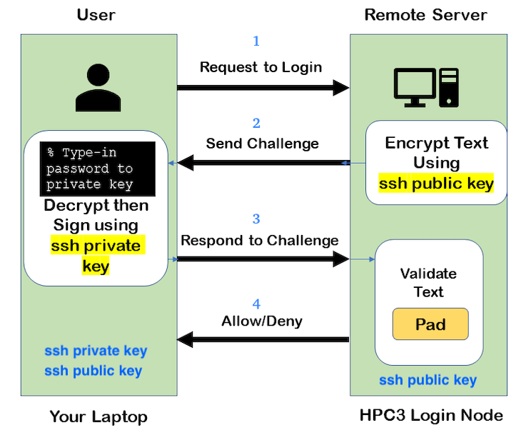
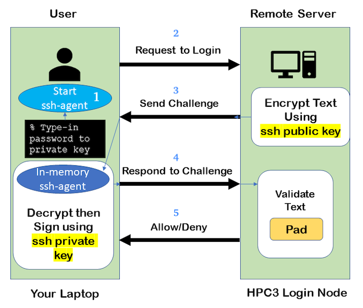

.. _ssh guide:

SSH keys
========

You must either be on the campus network or connected to the
`UCI campus VPN <https://www.oit.uci.edu/help/vpn>`_ to access HPC3.

.. _keys concepts:

Keys Concepts
-------------

A high-level  understanding of how things work will enable you to better secure your own logins
SSH uses :tt:`Public Key Cryptography` and :tt:`challenge/response` to negotiate secured sessions.

What do these terms really mean?

* :tt:`Public Key Cryptography` - text or data can be encrypted using the public key of the recipient.  The recipient then
  uses the matching private key to decrypt the message.
* :tt:`Challenge/Response` - the ssh server (e.g., HPC3) encrypts a message using your public ssh key and **challenges** your
  client on your laptop to decrypt it and send back a **response** based on the contents. If you can successfully respond to the
  *]*challenge**, the ssh server considers you authenticated.
* :tt:`Passphrase` - a password associated with your ssh key pair

The figure below shows where your SSH private key and
public keys are located. The server encrypts the **challenge** with YOUR public key.
You type in your passphrase to your private key each time you login.

.. centered:: :bluelight:`SSH Keys Challenge Response`

**The Algorithm Steps**:

  1. User **requests to login**.
  2. Server creates a random code and *encrypts* the code with the user's
     *ssh public key* and sends it back to the user - **challenge**.
  3. User *decrypts* the *challenge* with the user's *private ssh key*. To do
     it, need to type in the passphrase to that key. The now-decrypted *challenge* is used
     to create a valid response message. That message is digitally signed with the *private key*  and
     is then sent back to the server -  **response to challenge**.
  4. The server uses the user's public key to verify the authenticity and content of the message.
     If the *response* matches the *challenge*, then **access is granted otherwise it is denied**.

**Takeaways**

* Your private SSH key should never leave your laptop
* You should always use a strong password (passphrase) on your private ssh key
* This password should be different than all of your other passwords
* You need to type in your password each time you login

.. _ssh agent:

Ssh-agent
---------

If you have access to your private key and use it to *respond* to HPC3's *challenge*,
you need to type in the passphrase to that key for success.

**Ssh-agent enables you to load the key into the agent with a passphrase and have the agent
respond to login challenges for you.**

In essence, you type in private key passphrase once when loading your local agent
and then the agent responds for you.  In this scenario, you enter your the passphrase to your private key once.

.. centered:: :bluelight:`SSH Challenge Response with Agent`

**The algorithmic steps**:

  1. User **starts an ssh agent** then enters once the password to ssh key to activate the agent
  2. User **requests to login**
  3. Server creates a random code and *encrypts* the code with the user's *ssh public key*
     and sends it back to the user - **challenge**
  4. Ssh agent *decrypts* the *challenge* with the user's *private ssh key*,
     uses *decrypted challenge* to create a valid response message, digitally signs it
     with the *private key* and sends it back to the server - **response**.
  5. The server uses the user's public key to verify the authenticity and content of the message.
     If the *response* matches the *challenge*, then **access is granted otherwise it is denied**

**Takeaways**

* Using ssh-agent reduces the number of times you enter a password from the keyboard
* When you reboot your laptop (or logout), the agent is wiped from memory

.. _ssh-sgent windows:

Ssh-agent & Windows
--------------------

With the general background of how ssh-agent functions,
Microsoft **Windows 10/11** has two commonly-used ssh-agent mechanisms:

1. *Ssh-agent* running in Microsoft *Powershell*
2. *Putty ssh client* that uses *putty-gen* to create a public/private key
   pair and *pageant* as the ssh-agent.

Please see :ref:`ssh agents guides listing<ssh keys>`.

.. _ssh troubleshooting:

Troubleshooting
---------------

There are many online guides for ssh, please sea
:doc:`SSH</tutorials/listing>` links.
