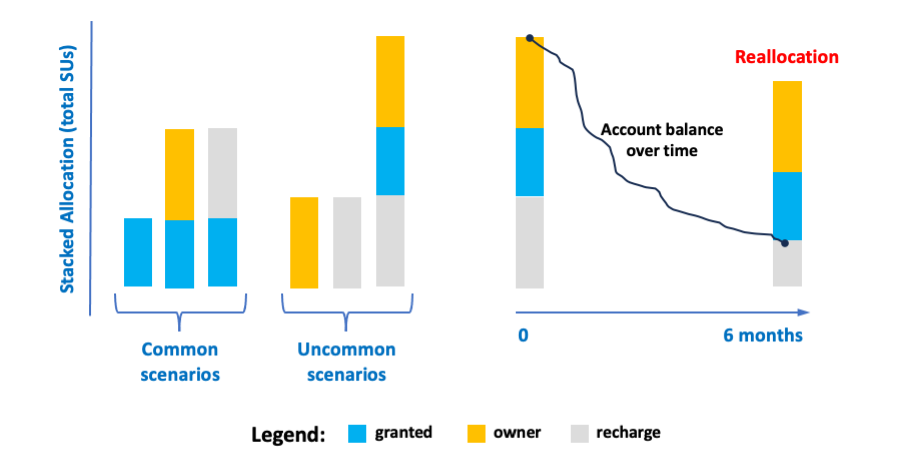

.. _reallocation:

Reallocation
============

.. contents::
   :local:

Overview
--------

The vision defined in 2016 was that any
  :bluelight:`Faculty member at UCI could request up to 200,000 core hours/year at no direct cost`

UCI invests in new equipment every year to reach this particular goal. The RCIC executive committee
also approved a plan that would not result on over-allocation of HPC3. 

**There are numerous challanges in fairly providing access to these hours**:
   * Any hour that a computing core sits idle is computing that is "lost forever."  
   * Actual computing needs are quite uneven. Some research groups need significantly more than 200K hours/year, some significantly less. 
   * Usage by any group is uneven throughout the year. Bursts of computing followed periods of reduced/no use is common. 

**To accommodate these challenges, these guiding principles are adopted**
   * Allocations for a particular group are re-computed (reallocation) every 6 months
   * About 1/6th of all allocations are recomputed monthly 
   * Use of hours in the previous 6 months should guide the actual allocation for the next interval
   * Unused hours in the previous 6 months are considered "lost."  In other words, unused hours don't 
     roll over.

.. note:: Reallocation is based upon a lab’s previous 6 month utilization and available hours
          on UCI-purchased hardware and is processed automatically.

          | Reallocation of granted hours is recomputed as *available hours over the next 6 month period*. 
          | Unused hours in previous 6 month period are considered forfeit.

.. _allocation stacking:

Stacking and Consumption
------------------------

| All allocations are expressed in core-hours or :term:`SUs`.
| Any particular lab allocation is made of up to three components:

  ============================================ =====================
  **No cost allocation**                       200K hours/year 
  -------------------------------------------- ---------------------
  **Purchased core hours**                     if any were bought
  -------------------------------------------- ---------------------
  **Converted hours from owned hardware**      if any were bought
  ============================================ =====================

At the beginning of every reallocation period these hours are lumped together
to make a total or "stacked allocation":

.. _stacked allocation:

   Stacked Allocation and Order of Debiting

There are six different stacking scenarios with the most common being: granted only, granted+owner, and 
granted+recharge. 

Order of debiting stacked allocation:
  | 1. owner SUs
  | 2. granted Sus
  | 3. recharge SUs

This ordering is important when RCIC recomputes how many granted hours should be given during reallocation.

.. _no-cost reallocation:

Granted hours
-------------

The total number of hours UCI can grant to faculty is limited by number of UCI-owned resources and the total request 
from faculty. To support the largest number of requests possible, RCIC allocates granted hours based upon actual use
over the previous 6 months (2 installments per year). The goal is to accommodate the reality that different research
programs truly have different levels of computing requirements.  

There are 5 bins of UCI-funded allocations (these are allocations for 6 months). We call this the
:underline:`base allocation`.

.. _allocaiton bins:

.. table:: Allocation Bins for Granted SUs
   :class: noscroll-table

   +----------------+------------------------------+
   | Hours          | Note                         |
   +================+==============================+
   | 100K hours     | Max allocation over 6 months |
   +----------------+------------------------------+
   |  75K hours     |                              |
   +----------------+------------------------------+
   |  50K hours     |                              |
   +----------------+------------------------------+
   |  25K hours     |                              |
   +----------------+------------------------------+
   |  12.5K hours   | Min allocation over 6 months |
   +----------------+------------------------------+

Any faculty member who requests hours is automatically granted 100K hours as their initial
:underline:`base allocation`.  The next 6 month allocation is based upon :underline:`actual utilization`
in the previous 6 months and the reallocation is calculated as follows:  

:usage > 85% base:
  allocated in the next larger bin up to max allocation.
:50 % < usage < 85 %:
  no change in allocation
:25 % < usage < 50 %:
  allocated in the next lower bin until minimum
:usage < 25%:
  allocated two lower bins down.
:usage < 100 hours for 12 months:
  set to Min allocation 

.. _reallocation bins:

.. table:: Example Reallocation Scenarios for no-cost Granted Core hours
   :class: noscroll-table

   +--------------------+-------+--------------+------------------------------+
   | Current Allocation | Usage | Reallocation | Reason                       |
   +=========+==========+=======+==============+==============================+
   | 75K                | 70K   | 100K         | Usage greater than 85%       |
   +--------------------+-------+--------------+------------------------------+
   | 75K                | 58K   | 75K          | Usage in range 50% - 85%     |
   +--------------------+-------+--------------+------------------------------+
   | 75K                | 37K   | 50K          | Usage is < 50%               |
   +--------------------+-------+--------------+------------------------------+
   | 75K                | 15K   | 25K          | Usage < 25%                  | 
   +--------------------+-------+--------------+------------------------------+
   | 75K                | 0     | 12.5K        | No usage. Reduced to minimum |
   +--------------------+-------+--------------+------------------------------+

.. note:: The algorithm above applies only to no-cost granted hours in the stack.

.. _converted hours:

Converted hours
---------------

Core-hours (SUs) converted from owner hardware are not binned. They are computed for 
what the hardware could deliver over the next  6 month period using the formula:

.. math:: SUs = ((Number_{cores} + 32 * Number_{GPUs}) * 8760 hours/year * .95)/2 

These are deposited for the :underline:`useful lifetime of the hardware` which is defined as 
:underline:`warranty period + 1 year`. Most hardware in HPC3 is purchased with 5 year warranties.
This means that a node will generate hours using the above formula for 6 years.
This assumes that the actual hardware is still functional for 1 year after warranty (that's usual). 

Any SUs not utilized in the previous 6 months are lost. This is no worse than if the hardware had 
been dedicated to the owner, but went unused for periods of time.

.. _purchased hours:

Purchased hours
---------------

Purchased cycle hours are expected to be used within 1 year and should be used on fairly regular basis.
As per MOU for cycle purchases, unused cycles are forfeit after 18 months. 
