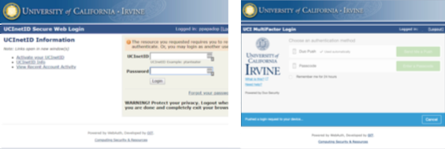
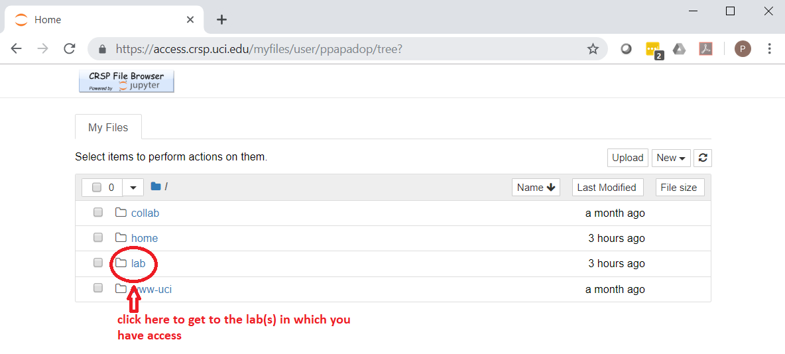

.. _crsp clients:

CRSP clients
============

.. contents::
   :local:

Depending on your laptop there are a few clients that can be installed.

Please note that RCIC does not provide Windows OS or macOS support for the campus.
If there is an operating system related issue, RCIC will refer you to you get support
to address your systems issue first before installing CRSP Desktop.

For issues with clients please see :ref:`crsp troubleshoot`

.. _client desktop mac:

CRSP Desktop App for MacOS
--------------------------

The CRSP Desktop for MacOS is a licensed and branded version of the generic |mduck|_ product.
It allows you to map one or more CRSP *drives* or *file paths* to a folder on your Mac.

**System Requirements**

.. table::
   :class: noscroll-table

   +------------------------------+---------------------------------------+
   | Supported Operating System   | Minimum Hardware Requirements         |
   +==============================+=======================================+
   | Monterey / Mojave /          | Intel or ARM (Apple Silicon) Processor|
   |                              |                                       |
   | Catalina / Big Sur / Ventura | 8 GB of memory                        |
   |                              |                                       |
   |                              | 1 GB of disk space                    |
   +------------------------------+---------------------------------------+

.. _mac download:

Download Desktop App
^^^^^^^^^^^^^^^^^^^^

.. important:: You must either be on the campus network or connected to the
               `UCI campus VPN <https://www.oit.uci.edu/help/vpn>`_ to download the installers.
.. important:: UCI pays a per-seat license for CRSP Desktop. Please do not share
               your downloaded copy of CRSP Desktop Installer with anyone.
.. important:: If you have a different (previous or newer) version of the CRSP Desktop (or Mountain Duck),
               you need to uninstall it.

**Download Step 1:**
  Using your choice of the web browser login to the `CRSP File Browser * <https://access.crsp.uci.edu/myfiles>`_
  using your UCNetID and passwordd, follow with DUO authentication:

  .. figure:: images/authenticate.png
      :align: center
      :width: 50%
      :alt: web browser login

      Figure 1: Login using your UCI credentials

**Download Step 2:**
  After a successful authentication in the **CRSP File Browser window** under
  :guilabel:`Files` tab click on the :guilabel:`software`:

  .. figure:: images/crsp-top-level.png
     :align: center
     :alt: crsp top level

     Figure 2: CRSP web browser top level

**Download Step 3:**
  After :guilabel:`software` opens click on the :guilabel:`CRSP-Desktop` folder.
  Select **CRSP-Desktop-Mac.zip** (this means click on a little square icon left of
  the file name, it will become checked) and then click :guilabel:`Download` to download the file.
  Note, the menu with :guilabel:`Download` will appear only after you select the file:

  .. figure:: images/mac/mac-download.png
     :align: center
     :alt: select file to download

     Figure 3: Select file to download

**Download Step 4:**
  You may see a pop-ip window asking to allow the download, click :guilabel:`Allow`:

  .. figure:: images/mac/mac-download-allow.png
     :align: center
     :width: 50%
     :alt: confirm download

     Figure 4: Confirm download

.. _mac install:

Install Desktop App
^^^^^^^^^^^^^^^^^^^

**Install Step 1:**
  Find the downloaded file, depending on your Mac configuration, the file is in your
  :tt:`Downloads` folder or in your :tt:`Desktop`:

  .. figure:: images/mac/mac-desktop-app.png
     :align: center
     :width: 50%
     :alt: downloaded crsp desktop app

     Figure 5: Downloaded CRSP Desktop app

**Install Step 2:**
  Double-click on the downloaded file name to launch the installation.
  You will see a confirmation window, click :guilabel:`Open`:

  .. figure:: images/mac/mac-desktop-open-confirm.png
     :align: center
     :width: 50%
     :alt: confirm opening download app

     Figure 6: Confirm opening of CRSP Desktop app

  Congratulations! CRSP Desktop is now installed in your system!

.. _mac configure share:

Configure Lab Share
^^^^^^^^^^^^^^^^^^^

This will **Map CRSP Lab Share** as a folder on your laptop.

**Configure Step 1**
  Once the CRSP Desktop application is opened, there will be a small icon in the top toolbar:

  .. figure:: images/mac/mac-top-toolbar.png
     :align: center
     :width: 70%
     :alt: crsp desktop app in the top toolbar

     Figure 7: CRSP Desktop app in the top toolbar

  First time the application is started, it will automatically open a template
  window where you can configure your connection. The template bookmark is labeled :tt:`panteater`.

  You will edit this bookmark with your specific information.

**Configure Step 2**
  The most common share to access is a lab share, owned by a UCI principal investigator.

  **Needed information to connect to CRSP**:

  * Your UCNetID
  * The UCNetID of the CRSP lab owner:

    * It is our UCNetID if you own CRSP Lab
    * It is the UCNetID of your adviser, If you are a graduate student or post-doctoral researcher

  In this example configuration, we are going to use the following specific
  information for user *npw* to access the *ppapadop* lab:

  * UCNetID - npw
  * UCNetID of the CRSP lab owner - ppapadop

  You will edit 4 fields in the default bookmark: :guilabel:`Nickname`, :guilabel:`Username`, :guilabel:`Password`
  and :guilabel:`Path`.

  .. figure:: images/mac/mac-bookmark-default.png
     :align: center
     :width: 70%
     :alt:  edit default bookmark

     Figure 8: Default template bookmark

  .. note:: Only the last part of the **Path** that represents your UCNetID (underlined)
            should be edited. The **/mmfs1/crsp/lab** must remain.

  .. note:: The **URL** is created from the information you type in other fields,
            you don't directly change it. This URL is for  using the SFTP protocol to access
            CRSP and is an end-to-end encrypted connection.

**Configure Step 3**
  After editing the bookmark with the specific information, your screen should
  look similar to the one below (but with your specific information in place):

  .. figure:: images/mac/mac-bookmark-edit.png
     :align: center
     :width: 70%
     :alt:  edit default bookmark

     Figure 9: Edited bookmark

  Click :guilabel:`Connect` to save the updated bookmark and to connect to the share

.. _mac connect share:

Connect to Lab Share
^^^^^^^^^^^^^^^^^^^^

After editing, if you click on the CRSP Desktop Notification Icon (top bar),
you should see your edited bookmark. For our example:

.. figure:: images/mac/mac-connect-to-lab.png
   :align: center
   :width: 70%
   :alt: connect to lab share

   Figure 10: Connect to Lab Share

At this point, your lab share is connected and you can use it just like a folder or network drive:

.. figure:: images/mac/mac-crsp-filebrowser.png
   :align: center
   :width: 70%
   :alt: lab share in file browser

   Figure 11: Lab Share in file browser

.. _mac add shares:

Add New Shares
^^^^^^^^^^^^^^

You are not limited to just a single, mapped, space. To create a new share,
click :guilabel:`Open Connection` to create a new template and edit it
following the directions above.

The following figure shows 3 configured shares:

.. figure:: images/mac/mac-bookmark-add.png
   :align: center
   :width: 70%
   :alt:  multiple shares

   Figure 12: Multiple Shares confgured

.. _client desktop windows:

CRSP Desktop App for Windows
-----------------------------

The CRSP Desktop for Windows is a licensed and branded version of the generic |mduck|_ product.
It allows you to map one or more CRSP *drives* or *file paths* to a folder on your PC.

**System Requirements**

.. table::
   :class: noscroll-table

   +------------------------------+---------------------------------------+
   | Supported Operating System   | Minimum Hardware Requirements         |
   +==============================+=======================================+
   | Windows                      | Pentium Class Processor               |
   | Windows 8 / Windows 10 /     |                                       |
   | Windows 11                   | 4 GB of memory (8 GB recommended)     |
   |                              |                                       |
   |                              | 1 GB of disk space                    |
   +------------------------------+---------------------------------------+

.. _windows download:

Download Desktop App
^^^^^^^^^^^^^^^^^^^^

.. important:: You must either be on the campus network or connected to the
               `UCI campus VPN <https://www.oit.uci.edu/help/vpn>`_ to download the installers.
.. important:: UCI pays a per-seat license for CRSP Desktop. Please do not share
               your downloaded copy of CRSP Desktop Installer with anyone.
.. important:: If you have a different (previous or newer) version of the CRSP Desktop (or Mountain Duck),
               you need to uninstall it.

**Download Step 1:**
  Using your choice of the web browser login to the `CRSP File Browser * <https://access.crsp.uci.edu/myfiles>`_
  using your UCNetID and passwordd, follow with DUO authentication:

  .. figure:: images/authenticate.png
      :align: center
      :width: 50%
      :alt: web browser login

      Figure 1: Login using your UCI credentials

**Download Step 2:**
  After a successful authentication in the **CRSP File Browser window** under
  :guilabel:`Files` tab click on the :guilabel:`software`:

  .. figure:: images/crsp-top-level.png
     :align: center
     :alt: crsp top level

     Figure 2: CRSP web browser top level

**Download Step 3:**
  After :guilabel:`software` opens click on the :guilabel:`CRSP-Desktop` folder.
  Select **CRSP-Desktop-Windows.exe** (this means click on a little square icon left of
  the file name, it will become checked) and then click :guilabel:`Download` to download the file.
  Note, the menu with :guilabel:`Download` will appear only after you select the file:

  .. figure:: images/win/win-download-crsp-desktop.png
     :align: center
     :alt: select file to download

     Figure 3: Select file to download

.. _windows install:

Install Desktop App
^^^^^^^^^^^^^^^^^^^

**Install Step 1**
  By default, the file is downloaded in your :guilabel:`Downloads` folder. Find the downloaded file,
  double-click on it to launch the installation. This installation includes the licensed version of
  CRSP Desktop.

**Install Step 2**
  In the opened window click :guilabel:`Install` to Install the CRSP Desktop on your laptop.

  .. figure:: images/win/win-install-crsp-desktop.png
     :align: center
     :width: 60%
     :alt: install downloaded app

     Figure 4: Install the CRSP Desktop.

**Install Step 3**
  After a successful installation, follow the instructions and
  click :guilabel:`Restart` to restart your computer:

  .. figure:: images/win/win-restart-computer.png
     :align: center
     :width: 60%
     :alt: restart computer

     Figure 5: Restart your computer

  Congratulations!  CRSP Desktop is now installed in your system!

.. _windows configure share:

Configure Lab Share
^^^^^^^^^^^^^^^^^^^

This will **Map CRSP Lab Share** as a folder on your laptop.

**Configure Step 1**
  CRSP Desktop shows in the Windows
  `Notification Area <https://support.microsoft.com/en-us/windows/customize-the-taskbar-notification-area-e159e8d2-9ac5-b2bd-61c5-bb63c1d437c3>`_
  (also known as *system  tray*). You can left-click or right-click on the :guilabel:`CRSP Desktop` icon to open it:

  .. figure:: images/win/win-access-crsp-desktop.png
     :align: center
     :width: 60%
     :alt: start desktop app

     Figure 6: Start CRSP Desktop App

  Once opened in a set of *bookmarks*  choose a template bookmark labeled :guilabel:`panteater`.

  .. figure:: images/win/win-edit-bookmark.png
     :align: center
     :width: 60%
     :alt: choose template bookmark

     Figure 7: Choose the template bookmark

  You will Edit this bookmark with your specific information.

**Configure Step 2**
  The most common share to access is a lab share, owned by a UCI principal investigator.

  **Needed information to connect to CRSP**:

  * Your UCNetID
  * The UCNetID of the CRSP lab owner:

    * It is our UCNetID if you own CRSP Lab
    * It is the UCNetID of your adviser, If you are a graduate student or post-doctoral researcher

  In this example configuration, we are going to use the following specific
  information for user *npw* to access the *ppapadop* lab:

  * UCNetID - npw
  * UCNetID of the CRSP lab owner - ppapadop

  You will edit 4 fields in the default bookmark: :guilabel:`Nickname`, :guilabel:`Username`, :guilabel:`Password`
  and :guilabel:`Path`.

  .. figure:: images/win/win-panteater-default.png
     :align: center
     :width: 60%
     :alt: default template bookmark

     Figure 8: Default template bookmark

  .. note:: Only the last part of the **Path** that represents your UCNetID (underlined)
            should be edited. The **/mmfs1/crsp/lab** must remain.

  .. note:: The **URL** is created from the information you type in other fields,
            you don't directly change it. This URL is for  using the SFTP protocol to access
            CRSP and is an end-to-end encrypted connection.

**Configure Step 3**
  After editing the bookmark with the specific information, your screen should
  look similar to the one below (with your information).
  Click :tt:`OK` to save the updated bookmark:

  .. figure:: images/win/win-edited-bookmark.png
     :align: center
     :width: 60%
     :alt: edited bookmark

     Figure 9: Edited bookmark

.. _windows connect share:

Connect to Lab Share
^^^^^^^^^^^^^^^^^^^^

After editing, if you click on the :guilabel:`CRSP Desktop` notification icon,
you should see your edited bookmark.  For our example, it looks like the following:

.. figure:: images/win/win-connect-to-lab.png
   :align: center
   :width: 60%
   :alt: connect to lab share

   Figure 10: Connect to Lab Share

Click :guilabel:`connect` to open your share.
At this point, your lab share is connected and you can use it just like a folder or network drive.

.. _windows add shares:

Add New Shares
^^^^^^^^^^^^^^
You are not limited to just a single, mapped, space. To create a new share,
click :guilabel:`Open Connection` to create a new template and edit it
following the directions above.

Here is an example with multiple connections configured and active:

.. figure:: images/win/win-multiple-connections.png
   :align: center
   :width: 60%
   :alt: multiple lab shares

   Figure 11: Multiple Lab Shares

.. _client web browser:

Web based File Browser
----------------------

A simple, easy to use *File Browser* is platform independent and is compatible
with most web browsers.

Please note that File Browser is suitable only for lightweight use.
We provide :ref:`client desktop mac` and :ref:`client desktop windows`
for moderate to heavy use.

.. important:: Your system must be updated with the latest version of Google Chrome, or Firefox or Safari

.. important:: You must be registered and setup with `UCI DUO <https://www.oit.uci.edu/help/duo>`_

.. _web browser login:

Logging in
^^^^^^^^^^^

Using your choice of the web browser, login on
`https://access.crsp.uci.edu/myfiles <https://access.crsp.uci.edu/myfiles>`_

You will see a standard UCI Webauth login screen and will be prompted for
UCINETID and password, followed by the prompts for DUO authentication:

   Figure 1: Standard Webauth Login

Once logged in, you will be presented with the CRSP top level screen. You can follow the links to
your Lab areas (shared) or HOME area (private).
The file browser will only show you folders for which you have access:

   Figure 2: Top level File Browser

.. important:: We recommend that you do most work on CRSP in your lab area.
               Lab areas are flexible for sharing.

You can be granted access to multiple Lab areas, but only you will have access to your HOME area.
HOME area is mainly used for files associated with the account, it is completely private area.

.. _web browser navigation:

Navigating File Browser
^^^^^^^^^^^^^^^^^^^^^^^

The File Browser is fairly easy to navigate, with some very basic sets of functions.

**Create files or directories**
  Click on :guilabel:`New` dropdown button, select :guilabel:`Text file` or
  :guilabel:`Folder`. Refer to the screenshot below:

   .. figure:: images/web/browser-dashboard2.png
      :align: center
      :width: 60%
      :alt:  Create a new file or folder

      Figure 3: Create a new file or folder

**Move files or directories**
  Select the file or folder, click on :guilabel:`Move`, and in a popup dialog box
  fill in the name of destination folder.  Refer to the screenshot below:

   .. figure:: images/web/browser-dashboard4.png
      :align: center
      :width: 60%
      :alt: move file or folder

      Figure 4: Move file or folder

**Delete files or directories**
  To delete one or more files or folders, select files or folders and click on
  the icon:trash[role="red"] to delete selected files or/and folders.  Refer to the screenshot below:

   .. figure:: images/web/browser-dashboard3.png
      :align: center
      :width: 60%
      :alt: delete file or folder

      Figure 5: Delete file or folder

**Upload/download files or directories**
  Files and folders could be uploaded using drag-n-drop capability in the file browser dashboard.
  Simply drag any file from your computer, an :guilabel:`Upload` button appears in the dashboard inline with the file name.
  Press :guilabel:`Upload` button, your file/folder will be uploaded via the file browser.  Refer to the screenshot below:

   .. figure:: images/web/browser-dashboard6.png
      :align: center
      :width: 60%
      :alt: upload/download file or folder

      Figure 6: Upload file/folder via drag-n-drop

**In-browser file editing**
  To use this feature just click on the file, a text editor will open in a new
  browser tab.  After completing edits, to save the edited file, select
  :guilabel:`File Save`. Refer to the screenshot below:

   .. figure:: images/web/browser-dashboard5.png
      :align: center
      :width: 60%
      :alt: in-browser file editing

      Figure 7: In-browser File Editing

.. _client sshfs:

Linux SSHFS
-----------

This page illustrates how use sshfs on Linux laptops for accessing CRSP.
Sshfs will **Map CRSP Lab Share** as a folder on your laptop.

.. _install sshfs:

Install sshfs
^^^^^^^^^^^^^

On your laptop you will need super user (sudo) rights to install sshfs.

For CentOS based laptop
  .. code-block:: console

     $ yum -y install sshfs

For Ubuntu/Debian based systems
  .. code-block:: console

     $ apt-get -y install sshfs

.. _mount sshfs:

Mount CRSP shares
^^^^^^^^^^^^^^^^^

.. important:: You must either be on the campus network or connected to the
               `UCI campus VPN <https://www.oit.uci.edu/help/vpn>`_ to use sshfs.

In this example there are two variables:

  * :tt:`username` - Your UCNetID
  * :tt:`labname` - The UCNetID of the CRSP lab owner:

    * It is our UCNetID if you own CRSP Lab
    * It is the UCNetID of your adviser, If you are a graduate student or post-doctoral researcher

From your desktop or laptop, execute the following command
replacing :tt:`username`  and :tt:`labname` with the appropriate UCNetIDs:

.. code-block::

   $ cd ~
   $ mkdir crsp_mount
   $ sshfs -o ssh_command='ssh -A -X -o StrictHostKeyChecking=no' \
           -o idmap=user username@access.crsp.uci.edu:/mmfs1/crsp/lab/labname \
           ~/crsp_mount

As a result, ``sshfs`` mounts CRSP Lab share under :tt:`~/crsp_mount`
directory. Use any name of your choice in place of :tt:`crsp_mount`.

**Sshfs will not automatically map all your remote UID and GID** from all of your CRSP groups
into your local Linux system. Note in the command above the use of :tt:`-o idmap=user` option.
This will only present your primary UID/GID from the remote CRSP system to your local system.

As the campus does not have a centralized directory service to manage every systems, options
on how to keep your local system and CRSP accounts synced are very limited.

.. _unmount sshfs:

Unmount CRSP shares
^^^^^^^^^^^^^^^^^^^^

To unmount the share that was mounted in the above example:
  .. code-block:: console

     $ fusermount -u ~/crsp_mount

.. _use sshfs:

Using sshfs
^^^^^^^^^^^

Examples of sshfs use:

Copy a file from your local system to your sshfs mounted drive
  .. code-block:: console

     $ cp ~/dir1/file.tar.gz ~/crsp_mount/share/

Recursively copy a directory from local system to mounted CRSP share using ``rsync``
  .. code-block:: console

     $ rsync -rltv ~/dir1 ~/crsp_mount/share/

.. _client from hpc3:

Access from HPC3
-----------------

On HPC3, CRSP shares are mounted in */share/crsp*:

.. code-block:: console

   [user@login-x:~]$ ls /share/crsp
   home  HOME-SNAPSHOTS  lab  LAB-SNAPSHOTS

:home:
  HOME area for all users accounts
:HOME-SNAPSHOTS:
  read-only access for HOME area snapshots
:lab:
  Lab area for all users accounts
:LAB-SNAPSHOTS:
  read-only access for LAB area snapshots

.. _hpc3 crsp home:

CRSP HOME
^^^^^^^^^

User CRSP HOME area is :tt:`/share/crsp/home/ucinetid`:

* it is a placeholder for login related files
* it is not the same as your cluster account's :tt:`$HOME`
* :red:`Do not store anything in your CRSP HOME`

File :tt:`/share/crsp/home/ucinetid/quotas.txt` in your CRSP HOME area
provides information about quotas. Please see :ref:`crsp quotas` for details.

.. _hpc3 crsp lab:

CRSP LAB
^^^^^^^^

LAB area is your primary storage area and is in  :tt:`/share/crsp/lab/ucinetid`
or any other LAB directories you have access for.

**If you are a PI and it's your lab**

.. table::
   :class: noscroll-table

   +----------+----------+----------------------------------+-----------------------------------------+
   | USERNAME | LABNAME  | Mounted location                 | Who has read/write access               |
   +==========+==========+==================================+=========================================+
   | your     | your     | /share/crsp/lab/LABNAME          | you can create any directories and files|
   |          |          +----------------------------------+-----------------------------------------+
   | UCINetID | UCINetID | /share/crsp/lab/LABNAME/USERNAME | your personal space                     |
   +----------+----------+----------------------------------+-----------------------------------------+

**If you are added to a PI lab** e.g., you are a student/postdoc in the lab

.. table::
   :class: noscroll-table

   +----------+----------+----------------------------------+-----------------------------------------+
   | USERNAME | LABNAME  | Mounted location                 | Who has read/write access               |
   +==========+==========+==================================+=========================================+
   | your     | your PI  | /share/crsp/lab/LABNAME/USERNAME | you and PI                              |
   |          |          +----------------------------------+-----------------------------------------+
   | UCINetID | UCINetID | /share/crsp/lab/LABNAME/share    | all lab members                         |
   +----------+----------+----------------------------------+-----------------------------------------+

The following example shows the directory structure and permissions (# by)
for a PI panteater who has a lab and added 2 students:

.. code-block:: console

   [user@login-x:~]$ ls -ld /share/crsp/lab/panteater
   drwxr-x--T 3 panteater panteater    512 Mar  6 15:58 /share/crsp/lab/panteater

   [user@login-x:~]$ ls -l /share/crsp/lab/panteater
   drwx--S--- 2 panteater panteater_lab       2048 Jul 12 10:22 panteater # by PI
   drwxrws--- 2 student1  panteater_lab        512 Apr 29 10:27 student1  # by student1/PI
   drwxrws--- 2 student2  panteater_lab        512 Apr 29 10:27 student2  # by student2/PI
   drwxrws--T 4 panteater panteater_lab_share  512 Nov  2  2020 share     # by all in lab

.. hpc3 crsp data:

Moving data to CRSP
^^^^^^^^^^^^^^^^^^^

Please see :ref:`data transfer` for in-depth  commands examples.

For example, to recursively copy your :tt:`mydir/` directory
from DFS6 to your LAB share on CRSP:

.. code-block:: console

   [user@login-x:~]$ rsync -rv /dfs6/pub/paneater/mydir /share/crsp/lab/panteater/

.. |mduck| replace:: Mountain Duck link:https://mountainduck.io/[Mountain Duck] product.
.. _`mduck`: https://mountainduck.io
