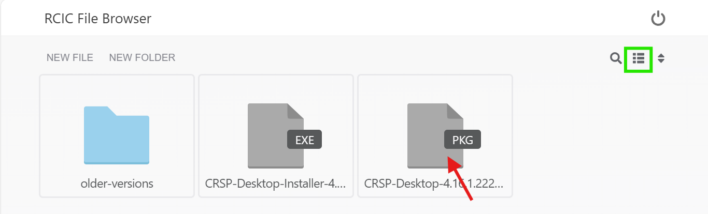
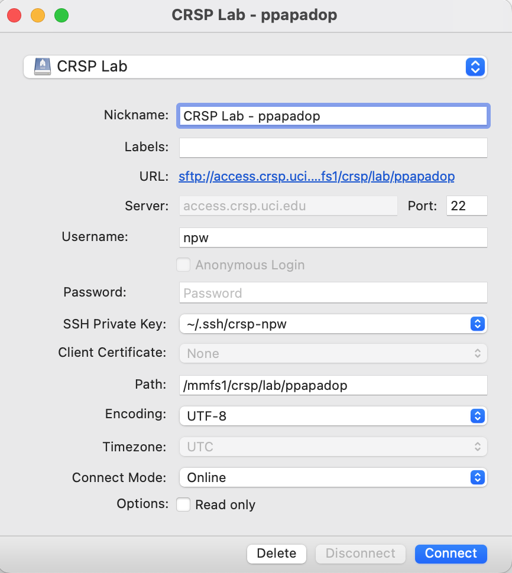

.. _crsp clients:

CRSP clients
============

Depending on your laptop there are a few clients that can be installed. 

.. _client desktop mac:

CRSP Desktop App for MacOS
--------------------------

The CRSP Desktop for MacOS is a licensed and branded version of the generic |mduck|_ product.
It allows you to map one or more CRSP *drives* or *file paths* to a folder on your Mac. 

**System Requirements**

.. table::
   :class: noscroll-table

   +------------------------------+---------------------------------------+
   | Supported Operating System   | Minimum Hardware Requirements         |
   +==============================+=======================================+
   | Monterey / Mojave /          | Intel or ARM (Apple Silicon) Processor|
   |                              |                                       |
   | Catalina / Big Sur / Ventura | 8 GB of memory                        |
   |                              |                                       |
   |                              | 1 GB of disk space                    |
   +------------------------------+---------------------------------------+

.. _mac download:

Download Desktop App
^^^^^^^^^^^^^^^^^^^^

.. important:: You must either be on the campus network or connected to the
               `UCI campus VPN <https://www.oit.uci.edu/help/vpn>`_ to download the installers.
.. important:: UCI pays a per-seat license for CRSP Desktop. Please do not share
               your downloaded copy of CRSP Desktop Installer with anyone.
.. important:: If you have a different (previous or newer) version of the CRSP Desktop (or Mountain Duck),
               you need to uninstall it. 

**Step 1:** 
Using your choice of the web browser login to the `CRSP File Browser * <https://access.crsp.uci.edu/myfiles>`_
using your UCNetID and passwordd, follow with DUO authentication:

    Figure 1: Login using your UCI credentials

**Step 2:** 
After a successful authentication in the **CRSP File Browser window** under
:guilabel:`Files` tab click on the :guilabel:`software`:

.. figure:: images/crsp-top-level.png
   :align: center
   :alt: crsp top level 

   Figure 2: CRSP web browser top level 

**Step 3:** 
After :guilabel:`software` opens click on the :guilabel:`CRSP-Desktop` folder.
Select **CRSP-Desktop-Mac.zip** (this means click on a little square icon left of
the file name, it will become checked) and then click :guilabel:`Download` to download the file.
Note, the menu with :guilabel:`Download` will appear only after you select the file:

   Figure 3: Select file to download 

**Step 4:** 
You may see a pop-ip window asking to allow the download, click :guilabel:`Allow`:

   Figure 4: Select file to download 

.. _mac install:

Install Desktop App
^^^^^^^^^^^^^^^^^^^

**Step 1:** 
Find the downloaded file, depending on your Mac configuration, the file is in your
:tt:`Downloads` folder or in your :tt:`Desktop`:

   Figure 5: Downloaded CRSP Desktop app

**Step 2:**
Double-click on the downloaded file name to launch the installation.
You will see a confirmation window, click :guilabel:`Open`:

   Figure 6: .Confirm opening of CRSP Desktop app

Congratulations! CRSP Desktop is now installed in your system!

.. _mac configure share:

Configure Lab Share
^^^^^^^^^^^^^^^^^^^

This will **Map CRSP Lab Share** as a folder on your laptop.

Once the CRSP Desktop application is opened, there will be a small icon in the top toolbar:

   Figure 7: CRSP Desktop app in the top toolbar

First time the application is started, it will automatically open a template
window where you can configure your connection. The template bookmark is labeled :tt:`panteater`.

You will edit this bookmark with your specific information.

The most common share to access is a lab share, owned by a UCI principal investigator.

**Needed information to connect to CRSP**:

* Your UCNetID
* The UCNetID of the CRSP lab owner:

  * It is our UCNetID if you own CRSP Lab
  * It is the UCNetID of your adviser, If you are a graduate student or post-doctoral researcher

In this example configuration, we are going to use the following specific
information for user *npw* to access the *ppapadop* lab:

* UCNetID - npw
* UCNetID of the CRSP lab owner - ppapadop

You will edit 4 fields in the default bookmark: :guilabel:`Nickname`, :guilabel:`Username`, :guilabel:`Password`
and :guilabel:`Path`.

.. figure:: images/mac/mac-bookmark-default.png
   :align: center
   :width: 70%
   :alt:  edit default bookmark

   Figure 8: Default template bookmark

.. note:: Only the last part of the **Path** that represents your UCNetID (underlined)
          should be edited. The **/mmfs1/crsp/lab** must remain.

.. note:: The **URL** is created from the information you type in other fields,
          you don't directly change it. This URL is for  using the SFTP protocol to access
          CRSP and is an end-to-end encrypted connection.

After editing the bookmark with the specific information, your screen should
look similar to the one below (but with your specific information in place):

   Figure 9: Edited bookmark 

Click :guilabel:`Connect` to save the updated bookmark and to connect to the share

.. _mac connect share:

Connect to Lab Share
^^^^^^^^^^^^^^^^^^^^

After editing, if you click on the CRSP Desktop Notification Icon (top bar),
you should see your edited bookmark. For our example:

.. figure:: images/mac/mac-connect-to-lab.png
   :align: center
   :width: 70%
   :alt: connect to lab share

   Figure 10: Connect to Lab Share

At this point, your lab share is connected and you can use it just like a folder or network drive:

.. figure:: images/mac/mac-crsp-filebrowser.png
   :align: center
   :width: 70%
   :alt: 

   Figure 11: Lab Share view in file browser

.. _mac add shares:

Add New Shares
^^^^^^^^^^^^^^

You are not limited to just a single, mapped, space. To create a new share,
click :guilabel:`Open Connection` to create a new template and edit it
following the directions above. 

The following figure shows 3 configured shares:

   Figure 12: Multiple Shares

.. _mac troubleshooting:

Troubleshooting
^^^^^^^^^^^^^^^

TODO If you encounter issues with the installation, contact CRSP support via e-mail hpc-support@uci.edu.

.. _client desktop windows:

CRSP Desktop App for Windows
-----------------------------

The CRSP Desktop for Windows is a licensed and branded version of the generic |mduck|_ product.
It allows you to map one or more CRSP *drives* or *file paths* to a folder on your PC. 

**System Requirements**

.. table::
   :class: noscroll-table

   +------------------------------+---------------------------------------+
   | Supported Operating System   | Minimum Hardware Requirements         |
   +==============================+=======================================+
   | Windows                      | Pentium Class Processor               |
   | Windows 8 / Windows 10 /     |                                       |
   | Windows 11                   | 4 GB of memory (8 GB recommended)     |
   |                              |                                       |
   |                              | 1 GB of disk space                    |
   +------------------------------+---------------------------------------+

.. _windows download:

Download Desktop App
^^^^^^^^^^^^^^^^^^^^

.. important:: You must either be on the campus network or connected to the
               `UCI campus VPN <https://www.oit.uci.edu/help/vpn>`_ to download the installers.
.. important:: UCI pays a per-seat license for CRSP Desktop. Please do not share
               your downloaded copy of CRSP Desktop Installer with anyone.
.. important:: If you have a different (previous or newer) version of the CRSP Desktop (or Mountain Duck),
               you need to uninstall it. 

**Step 1:** 
Using your choice of the web browser login to the `CRSP File Browser * <https://access.crsp.uci.edu/myfiles>`_
using your UCNetID and passwordd, follow with DUO authentication:

    Figure 1: Login using your UCI credentials

**Step 2:** 
After a successful authentication in the **CRSP File Browser window** under
:guilabel:`Files` tab click on the :guilabel:`software`:

.. figure:: images/crsp-top-level.png
   :align: center
   :alt: crsp top level 

   Figure 2: CRSP web browser top level 

**Step 3:** 
After :guilabel:`software` opens click on the :guilabel:`CRSP-Desktop` folder.
Select **CRSP-Desktop-Windows.exe** (this means click on a little square icon left of
the file name, it will become checked) and then click :guilabel:`Download` to download the file.
Note, the menu with :guilabel:`Download` will appear only after you select the file:

   Figure 3: Select file to download 

.. _windows install:

Install Desktop App
^^^^^^^^^^^^^^^^^^^

**Step 1** By default, the file is downloaded in your :guilabel:`Downloads` folder. Find the downloaded file,
double-click on it to launch the installation. This installation includes the licensed version of
CRSP Desktop.

**Step 2**  In the opened window click :guilabel:`Install` to Install the CRSP Desktop on your laptop.

   Figure 4: Install the CRSP Desktop on Your System.

**Step 3** After a successful installation, follow the instructions and 
click :guilabel:`Restart` to restart your computer:

   Figure 5: Restart your system

Congratulations!  CRSP Desktop is now installed in your system!

.. _windows configure share:

Configure Lab Share
^^^^^^^^^^^^^^^^^^^

CRSP Desktop shows up  in the Windows
link:https://support.microsoft.com/en-us/windows/customize-the-taskbar-notification-area-e159e8d2-9ac5-b2bd-61c5-bb63c1d437c3[*Notification Area* or *system  tray*].  You can left-click or right-click on the CRSP Desktop icon to configure
your specific folders.

.CRSP Desktop is accessed in the Windows Notification Area
image::win/win-access-crsp-desktop.png[width=50%,align="center"]

Click on the CRSP Desktop Icon to open a set of _bookmarks_. There is a template bookmark labeled [.tt]*panteater*.
You will edit this bookmark with your specific information.

[#img-edit-bookmark]
.Click on the CRSP Desktop Icon and then _Edit_ the panteater bookmark
image::win/win-edit-bookmark.png[width=50%,align="center"]

=== Mapping Your CRSP Lab Share

The most common share to access is a lab share, owned by a UCI principal investigator. If you are a graduate
student or post-doctoral researcher, you will need to know the UCNetID of your advisor.

**Needed information to connect to CRSP**:

. Your UCNetID
. The UCNetID of the CRSP lab owner (usually your PI, or your UCNetID if it is your CRSP Lab)

In this example configuration, we are going to use the following specific
information for user "ppapadop" to access the "npw" lab:

. UCNetID - ppapadop
. UCNetID of lab owner - npw

You will edit four (4) fields in the default bookmark: **Nickname**, **Username**, **Password** and **Path**

[#img-default-bookmark]
.Fields to edit in the default bookmark
image::win/win-panteater-default.png[align="center", width=50%]

NOTE: only the last part of the Path that represents your UCNetID (underlined green)
should be edited. The [.tt]*/mmfs1/crsp/lab* must remain.

NOTE: The URL is created from the information you type in, you don't directly
change it. This is using the SFTP protocol to access
CRSP and is an end-to-end encrypted connection.

After editing the bookmark with the specific information, your screen should
look similar to the one below (but with your specific information in place).
Click [.tt]*OK* to save the updated bookmark

[#img-edited-bookmark]
.Edited bookmark. Click OK to Save.
image::win/win-edited-bookmark.png[align="center", width=50%]

.. _windows connect share:

Connect to Lab Share
^^^^^^^^^^^^^^^^^^^^

After editing, if you click on the CRSP Desktop Notification Icon, you should see your edited bookmark.
For our example, it looks like the following:

[#img-connect-to-lab]
.Edited Bookmark Saved. Click connect to open your share
image::win/win-connect-to-lab.png[align="center", width=50%]

At this point, your lab share is connected and you can use it just like a folder or network drive.

.. _windows add shares:

Add New Shares
^^^^^^^^^^^^^^

You are not limited to just a single, mapped, space. To create a new share,
click [.tt]*Open Connection* to create a new template and edit it
following the directions above.

Here is an example with multiple connections configured and active.
[#img-multiple-connected]
.Multiple connections to different CRSP labs
image::win/win-multiple-connections.png[align="center", width=30%]

include::crsp-links.txt[]

.. _windows troublwshooting:

Troubleshooting
^^^^^^^^^^^^^^^

TODO If you encounter issues with the installation, contact CRSP support via e-mail hpc-support@uci.edu.

.. _client web browser:

Web Browser
-----------

.. _client sshfs:

Linux SSHFS 
-----------

.. _client from hpc3:

Access from HPC3
-----------------

.. |mduck| replace:: Mountain Duck link:https://mountainduck.io/[Mountain Duck] product.
.. _`mduck`: https://mountainduck.io
