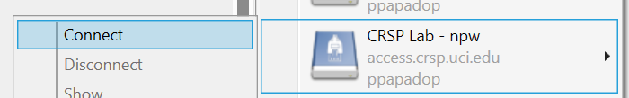

.. _crsp clients:

CRSP clients
============

.. contents::
   :local:

Depending on your laptop there are a few clients that can be installed.

Please note that RCIC does not provide Windows OS or macOS support for the campus.
If there is an operating system related issue, RCIC will refer you to you get support
to address your systems issue first before installing CRSP Desktop.

For issues with clients please see :ref:`crsp troubleshoot`

.. _duo crsp:

DUO Multifactor Authentication
------------------------------

In July 2024, `Campus DUO authentication <https://www.oit.uci.edu/services/accounts-passwords/duo/>`_  
will be **mandatory** for all CRSP desktop clients.  The push response of DUO can become very tiresome. 
On some clients, DUO can make CRSP unusable because *every* file transfer requires *another* 
DUO push.  RCIC cannot "turn off DUO." 

However, **ssh keys** with **strong passwords** is a *secure* method to to provide a different 
second factor of authentication. SSH keys managed properly do not require DUO after initial setup but still maintain
strong security.  *Never copy an ssh private key file!*

.. _crsp quick start:

**Quick Start**

1. You should follow the guide to :ref:`generate ssh keys` for different platforms. 

   .. note::
       It is **highly recommended** that your private key file is in 
       *PEM* format *and* has a :tt:`.pem` file extension.
       The CRSP desktop client seems to more reliably recognize :ref:`PEM-formatted keys <generate PEM-formatted keys>`

   .. note::
       If using Windows, it is recommended to use the :ref:`Powershell method <generate-ssh-keys-windows-powershell>` 
       for generating keys and not use PuTTY.

2. Use the :ref:`manage crsp keys` guide for uploading public keys to CRSP

3. **DO NOT COPY** *private* ssh-keys. Every different physical device should have a different *ssh key pair*

4. .. important:: 
        | *All ssh keys* that you generate *MUST have a strong password*.
        | **Passwordless keys are a security violation**.

   Learn how to use `SSH Agent <https://www.ssh.com/academy/ssh/agent>`_ on your desktop/laptop. If on Windows,
   you can also `Putty's pageant <https://winscp.net/eng/docs/ui_pageant>`_. SSH agents securely store a private
   key *in memory* so that you only have to type the key's password once.

.. _manage crsp keys:

Managing Public SSH Keys on CRSP
--------------------------------

CRSP uses ``ssh`` for authentication but *does not grant shell access*.  This means that common methods 
updating as user's :tt:`authorized_keys` file cannot be used.

Since there is no shell access to CRSP, you *should use* the procedure below to copy your
ssh public key to CRSP.

To make ssh key management a bit more tractable, RCIC has built a very simple facility to *add* a new public
key to your :tt:`$HOME/.ssh/authorized_keys` file on CRSP or to completely *replace* the contents of the
:tt:`authorized_keys` file.

.. note::

   In the steps below, command-line clients are used. These are available at the Linux terminal, the
   Mac Terminal, Windows Command line, and Windows Powershell.

1. **Add an SSH Public Key**

   Suppose you have new *public* key in format similar to (single line broken for readability):

   .. parsed-literal::

      ssh-rsa AAAAB3NzADAQABAAABgQC1QciUGQzHTtSfnibqUqOotPVPYQcnJ71P12lHhy5R4K9h8SnYQHopwPK0
      LxRWkc51LyI6cDSUbV2vmVBCBhAaYiUDmZIBwqXVToHn/B4MEGOBscT3jVd5cSC3F29dPU/oMEED5EPlZe2mZnOn
      VMaCK4tlNA5BpBc2oXQzlYZKcaT8PVAK8lC+iom6ECrGm8BBcKSkU7H8A5qbof8jfHrqDHWm2GB6/PezHo4UHEfWH
      jPA3QknLjRU71ydNmwoIPPLqSKsYEXyK+E/ULhkJOhU8QCusuKEE6hbScoEJJVgjj1vfiTigyg1khcj1v/QrnV
      5IJiqx6vpkOhfbmb05qzUEL34AklhPkL3xpEb0n4Fefp8oE2cugSyYd1vRmLfGsaljgh9LzzBgvdFyeJi
      k= ssh key panteater@uci.edu for crsp 

   **Now you need to add this key so that it can be recognized by CRSP**. To accomplish this, use 
   ``sftp`` to put the *public key* into the file :tt:`$HOME/.ssh/add` on CRSP. You will be asked for DUO authentication
   to authenticate to CRSP.

   In the following example, **replace** *panteater* with your UCINetID and **replace** the *panteater-uci.pub*
   with the name of the file on your laptop that holds your **public key**. 

   What you type is in :bluelight:`blue`:

   .. _sftp put public key:

   .. parsed-literal::
   
      :bluelight:`cd $HOME/.ssh`                              # 1
      :bluelight:`sftp panteater@access.crsp.uci.edu:.ssh`    # 2
      Password:
      Duo two-factor login for panteater
   
      Enter a passcode or select one of the following options:
   
           1. Duo Push to XXX-XXX-1234
   
      Passcode or option (1-1): :bluelight:`1`
      Connected to access.crsp.uci.edu.
      Changing to: /mmfs1/crsp/home/panteater/.ssh
      **sftp>** :bluelight:`put panteter-uci.rsa.pub add`         # 3
      Uploading panteater-uci.rsa.pub to /mmfs1/crsp/home/panteater/.ssh/add
      panteater-uci.rsa.pub                                    100%  742     9.1KB/s   00:00
      **sftp>** :bluelight:`ls`                                   # 4
        add              authorized_keys  known_hosts
      **sftp>** :bluelight:`quit`                                 # 5
      :bluelight:`cd $HOME`                                   # 6
   
   1. The first ``cd`` command puts you in a directory where your ssh keys are.
   2. The ``sftp`` command makes a secure connection to the CRSP server.
   3. The sftp's ``put`` command copies your public ssh key from your laptop to the CRSP server.
   4. the sftp's ``ls`` command output must have :tt:`add` listed. Additional files
      as shown above may be present if you have previously used ssh and added keys.
   5. The sftp's ``quit`` command  stops sftp session.
   6. The last ``cd`` command puts you in your home area on your laptop.

   After approximately 5 minutes, on the CRSP server the contents of what you uploaded into the file named :tt:`add` will be appended
   to your :tt:`$HOME/.ssh/authorized_keys` file.  You will know that this has been completed when the file :tt:`add` disappears.

2. **Verifying Access**

   Once your :tt:`$HOME/.ssh/authorized_keys` file is appended, you should be able to ``sftp`` 
   to CRSP using the *private* key as the identity as in the following 
   example. Notice that the *passphrase* for the key was requested and DUO was *not* required:

   .. parsed-literal::

       :bluelight:`sftp -i panteater-uci panteater@access.crsp.uci.edu`
       Enter passphrase for key 'panteater-uci':
       Connected to access.crsp.uci.edu.
       **sftp>** :bluelight:`quit`

**Starting over: Overwrite authorized_keys**

   Sometimes your :tt:`$HOME/.ssh/authorized_keys` needs more complex editing than simple addition of new
   key.  You can completely *overwrite* the contents of the :tt:`authorized_keys` file with a new version.

   1. Create a new version of the file on your local machine called :tt:`newkeys`. Edit it so that it appears exactly how it 
      you need it to appear on CRSP.
      
      .. danger:: You need to understand the format of :tt:`authorized_keys` file
         and what to put there.  Ad hoc editions can make your CRSP access unusable
         if you upload a bad file. 

   2. Follow the :ref:`SFTP Procedure <sftp put public key>` **EXCEPT**  once
      you get to the sftp prompt **sftp>** put the file as `overwrite` instead of `add`:  

      .. parsed-literal::

         **sftp>** :bluelight:`put newkeys overwrite`
         Uploading newkeys to /mmfs1/crsp/home/panteater/.ssh/overwrite
         overwrite                                    100%  742     9.1KB/s   00:00
         **sftp>** :bluelight:`ls`
           overwrite   authorized_keys  known_hosts
         **sftp>** :bluelight:`quit`

   3. Wait 5 minutes for the new file to be put in place

.. _crsp access methods:

Supported Protocols for Accessing CRSP
--------------------------------------

There are only three underlying data transfer protocols supported for accessing CRSP:

:SFTP:
  | `The secure shell file transfer protocol <https://www.ssh.com/academy/ssh/sftp-ssh-file-transfer-protocol>`_. 
  | This is the *only* protocol available to desktop clients.

:NFSv4: 
  | Network File System.
  | This is only supported on :ref:`HPC3 <hpc3>` through the path :tt:`/share/crsp`.

:HTTPS:
  | This provides very simple, browser-based access to CRSP.
  | This is a *fallback* access method.

.. _client desktop mac:

CRSP Desktop App for macOS
--------------------------

The CRSP Desktop for macOS is a licensed and branded version of the generic |mduck|_ product.
It allows you to map one or more CRSP *drives* or *file paths* to a folder on your Mac.

.. table:: **System Requirements**
   :align: center
   :class: noscroll-table

   +------------------------------+---------------------------------------+
   | Supported Operating System   | Minimum Hardware Requirements         |
   +==============================+=======================================+
   | Monterey / Mojave /          | Intel or ARM (Apple Silicon) Processor|
   |                              |                                       |
   | Catalina / Big Sur / Ventura | 8 GB of memory                        |
   |                              |                                       |
   |                              | 1 GB of disk space                    |
   +------------------------------+---------------------------------------+

.. _mac download:

macOS: Download Desktop App
^^^^^^^^^^^^^^^^^^^^^^^^^^^

.. important:: * You must either be on the campus network or connected to the
                 `UCI campus VPN <https://www.oit.uci.edu/help/vpn>`_ to download the installers.
               * UCI pays a per-seat license for CRSP Desktop.
                 Please do not share your downloaded copy of CRSP Desktop Installer with anyone.
               * If you have a different (previous or newer) version of the
                 CRSP Desktop (or Mountain Duck), you need to uninstall it.

**Download Step 1:**
  Using your choice of the web browser login to the `CRSP File Browser <https://access.crsp.uci.edu/myfiles/>`_
  using your UCNetID and password, follow with DUO authentication:

  .. figure:: images/crsp/authenticate.png
      :align: center
      :width: 50%
      :alt: web browser login

      Login using your UCI credentials

**Download Step 2:**
  | After a successful authentication the window will look similar to the one shown below.
  | Click on the :guilabel:`CRSP-Desktop-Downloads` tab, then click on the :guilabel:`CONNECT`:

  .. figure:: images/crsp/crsp-browser-top-level.png
     :align: center
     :width: 80%
     :alt: crsp top level

     CRSP web browser top level

**Download Step 3:**
  You should see three items on screen: a :guilabel:`.pkg` file for Mac clients, a :guilabel:`.exe` file for Windows,
  and :guilabel:`older-versions` folder.  To toggle the between list and icon view  click on the Layout
  icon :green:`outlined in green`.

  For the Mac, simply click on the file with :guilabel:`.pkg` ending:

  .. figure:: images/mac/mac-download.png
     :align: center
     :width: 80%
     :alt: select file to download

     Select file to download

**Download Step 4:**
  You should then see a screen with a download button on it and the full name of the file that will be downloaded
  to your local computer. Click :guilabel:`Download`:

  .. figure:: images/mac/mac-download-2.png
     :align: center
     :width: 80%
     :alt: Download

     Download

  You may see a popup window asking  if you want to allow downloads from this
  site, click on :guilabel:`Allow` button and save the file to your local computer:

  .. figure:: images/mac/mac-download-allow.png
     :align: center
     :width: 50%
     :alt: Download

     Confirm download

.. _mac install:

macOS: Install Desktop App
^^^^^^^^^^^^^^^^^^^^^^^^^^

**Install Step 1:**
  Find the downloaded file, depending on your Mac configuration, the file is in your
  :tt:`Downloads` folder or in your :tt:`Desktop`:

  .. figure:: images/mac/mac-desktop-app.png
     :align: center
     :width: 80%
     :alt: downloaded crsp desktop app

     Downloaded CRSP Desktop app

**Install Step 2:**
  Double-click on the downloaded file name to launch the installation.
  You will see a confirmation window, click :guilabel:`Open`:

  .. figure:: images/mac/mac-desktop-open-confirm.png
     :align: center
     :width: 80%
     :alt: confirm opening download app

     Confirm opening of CRSP Desktop app

  Congratulations! CRSP Desktop is now installed in your system!

.. _mac configure share:

macOS: Configure Lab Share
^^^^^^^^^^^^^^^^^^^^^^^^^^

This will **Map CRSP Lab Share** as a folder on your laptop.

**Configure Step 1**
  Once the CRSP Desktop application is opened, there will be a small icon in the top toolbar:

  .. figure:: images/mac/mac-top-toolbar.png
     :align: center
     :width: 80%
     :alt: crsp desktop app in the top toolbar

     CRSP Desktop app in the top toolbar

  First time the application is started, it will automatically open a template
  window where you can configure your connection. The template bookmark is labeled :tt:`panteater`.

  You will edit this bookmark with your specific information.

**Configure Step 2**
  The most common share to access is a lab share, owned by a UCI principal investigator.

  **Needed information to connect to CRSP**:

  * Your UCNetID
  * The UCNetID of the CRSP lab owner:

    * It is our UCNetID if you own CRSP Lab
    * It is the UCNetID of your adviser, If you are a graduate student or post-doctoral researcher

  In this example configuration, we are going to use the following specific
  information for user *npw* to access the *ppapadop* lab:

  * UCNetID - npw
  * UCNetID of the CRSP lab owner - ppapadop

  You will edit 5 fields in the default bookmark: :guilabel:`Nickname`, :guilabel:`Username`, 
  :guilabel:`SSH Private Key`, :guilabel:`Path`, and :guilabel:`Connect Mode`:

  .. figure:: images/mac/mac-bookmark-default.png
     :align: center
     :width: 70%
     :alt:  edit default bookmark

     Default template bookmark

  .. attention:: 
            * :guilabel:`Nickname` - we recommend that you change it to something like: **CRSP LAb - <pi> lab**
            * :guilabel:`Username` - your UCINetID
            * :guilabel:`SSH Private Key` - use an SSH key name that you should have generated when following the 
              :ref:`Quick Start <crsp quick start>` procedure for working effectively with DUO.
              The corresponding public key should have also been :ref:`copied <manage crsp keys>`
              to :tt:`~/.ssh/authorized_keys` on CRSP itself.
            * :guilabel:`Path` - only the last part (highlighted) that represents **CRSP Lab Owner's UCNetID**
              should be edited. The **/mmfs1/crsp/lab** must remain unchanged.
            * :guilabel:`Connect Mode` - should be changed to **Online**. This keeps all files on CRSP
              and reduces local cache space. If you use CRSP from multiple clients, this the *most reliable*
              mechanism for keeping all data in sync.
            * The **URL** is created automatically from the information you type in other fields,
              you don't directly change it. This URL is for  using the SFTP protocol to access
              CRSP and is an end-to-end encrypted connection.

**Configure Step 3**
  After editing the bookmark with the specific information, your screen should
  look similar to the one below (but with your specific information in place):

  .. figure:: images/mac/mac-bookmark-edit.png
     :align: center
     :width: 70%
     :alt:  edit default bookmark

     Edited bookmark

  Click :guilabel:`Connect` to save the updated bookmark and to connect to the share

.. _mac connect share:

macOS: Connect to Lab Share
^^^^^^^^^^^^^^^^^^^^^^^^^^^

After editing, if you click on the CRSP Desktop Notification Icon (top bar),
you should see your edited bookmark. For our example:

   Connect to Lab Share

At this point, your lab share is connected and you can use it just like a folder or network drive:

.. figure:: images/mac/mac-crsp-filebrowser.png
   :align: center
   :width: 80%
   :alt: lab share in file browser

   Lab Share in file browser

.. note:: The snapshots folder is *hidden*.
          To view hidden files/folders in Finder, on the open folder
          press :guilabel:`Command + Shift + .` (period) to make the hidden files appear.
 
.. _mac duo vs passphrase:

macOS: Password + DUO vs. Passphrase
^^^^^^^^^^^^^^^^^^^^^^^^^^^^^^^^^^^^

You have two authentication options when connecting to CRSP:

:bluelight:`1. SSH Key with Passphrase`
   **What to Expect with a Passphrase**

   It is highly recommended that you use ssh keys with a passphrase as described in the
   :ref:`Quick Start <crsp quick start>` guide.

   When you click :guilabel:`connect` in the :ref:`previous step <mac connect share>`, you should see popup
   window similar to the following (with your ssh key info):

   .. figure:: images/mac/mac-crsp-passphrase.png
      :align: center
      :width: 50%
      :alt: enter ssh key passphrase share

      Enter the ssh key passphrase

   Notice that a local file (ssh private key :tt:`~/.ssh/crsp-npw`) and a *passphrase* are requested.
   You can optionally save the passphrase.

   Assuming that the *public* key for the private key has been properly installed on CRSP, you should be connected
   *without a DUO prompt*.

:bluelight:`2. UCINetID + password + DUO Push`
   **What to expect with a Password + DUO**

   If you do NOT install an ssh key, you will be prompted for your UCINetID password and a DUO push. Even if you have
   the CRSP Desktop remember your password, the DUO Push will be **required each and every time** the desktop
   reconnects to CRSP.

   :bluelight:`Step 1` Enter your password, similar to the following:

   .. figure:: images/mac/mac-crsp-username-pw.png
      :align: center
      :width: 60%
      :alt: enter user password

      Enter the password associated with YOUR UCINetID

   :bluelight:`Step 2` Respond to the DUO push 

   .. figure:: images/mac/mac-crsp-duo.png
      :align: center
      :width: 50%
      :alt: Respond to DUO

      Respond to DUO

   Usually, you would enter 1 in the box, click on :guilabel:`Continue` and you will receive a duo push on your phone.
   If your phone isn’t available, then you can enter one of your DUO backup codes that
   you set up when you enrolled in DUO through the UCI Office of Information Technology.

.. _mac add shares:

macOS: Add New Shares
^^^^^^^^^^^^^^^^^^^^^

You are not limited to just a single, mapped, space. To create a new share,
click :guilabel:`Open Connection` to create a new template and edit it
following the directions above.

The following figure shows 3 configured shares:

.. figure:: images/mac/mac-bookmark-add.png
   :align: center
   :width: 70%
   :alt:  multiple shares

   Multiple Shares confgured

.. _client desktop windows:

CRSP Desktop App for Windows
-----------------------------

The CRSP Desktop for Windows is a licensed and branded version of the generic |mduck|_ product.
It allows you to map one or more CRSP *drives* or *file paths* to a folder on your PC.

.. table:: **System Requirements**
   :align: center
   :class: noscroll-table

   +------------------------------+---------------------------------------+
   | Supported Operating System   | Minimum Hardware Requirements         |
   +==============================+=======================================+
   |                              | Pentium Class Processor               |
   | Windows 10 /                 |                                       |
   | Windows 11                   | 4 GB of memory (8 GB recommended)     |
   |                              |                                       |
   |                              | 1 GB of disk space                    |
   +------------------------------+---------------------------------------+

.. _windows download:

Windows: Download Desktop App
^^^^^^^^^^^^^^^^^^^^^^^^^^^^^

.. important:: * You must either be on the campus network or connected to the
                 `UCI campus VPN <https://www.oit.uci.edu/help/vpn>`_ to download the installers.
               * UCI pays a per-seat license for CRSP Desktop. Please do not share
                 your downloaded copy of CRSP Desktop Installer with anyone.
               * If you have a different (previous or newer) version of the CRSP Desktop (or Mountain Duck),
                 you need to uninstall it.

**Download Step 1:**
  Using your choice of the web browser login to the `CRSP File Browser <https://access.crsp.uci.edu/myfiles/>`_
  using your UCNetID and password, follow with DUO authentication:

  .. figure:: images/crsp/authenticate.png
      :align: center
      :width: 50%
      :alt: web browser login

      Login using your UCI credentials

**Download Step 2:**
  | After a successful authentication the window will look similar to the one shown below.
  | Click on the :guilabel:`CRSP-Desktop-Downloads` tab, then click on the :guilabel:`CONNECT`:

  .. figure:: images/crsp/crsp-browser-top-level.png
     :align: center
     :width: 80%
     :alt: crsp top level

     CRSP web browser top level

**Download Step 3:**
  You should see three items on screen: a :guilabel:`.pkg` file for Mac clients, a :guilabel:`.exe` file for Windows,
  and :guilabel:`older-versions` folder.  To toggle the between list and icon view click on the Layout
  icon :green:`outlined in green`.

  For the Windows, simply click on the file with :guilabel:`.exe` ending.

  .. figure:: images/win/win-download-crsp-desktop.png
     :align: center
     :width: 80%
     :alt: select file to download

     Select file to download

**Download Step 4:**
  You should then see a screen with a download button on it and the full name of the file that will be downloaded
  to your local computer. Click :guilabel:`Download` and save the file to your local computer:

  .. figure:: images/win/win-download-crsp-desktop-2.png
     :align: center
     :width: 80%
     :alt: Download

     Download

.. _windows install:

Windows: Install Desktop App
^^^^^^^^^^^^^^^^^^^^^^^^^^^^

**Install Step 1**
  By default, the file is downloaded in your :guilabel:`Downloads` folder. Find the downloaded file,
  double-click on it to launch the installation. This installation includes the licensed version of
  CRSP Desktop.

**Install Step 2**
  In the opened window click :guilabel:`Install` to Install the CRSP Desktop on your laptop.

  .. figure:: images/win/win-install-crsp-desktop.png
     :align: center
     :width: 60%
     :alt: install downloaded app

     Install the CRSP Desktop.

**Install Step 3**
  After a successful installation, follow the instructions and
  click :guilabel:`Restart` to restart your computer:

  .. figure:: images/win/win-restart-computer.png
     :align: center
     :width: 60%
     :alt: restart computer

     Restart your computer

  Congratulations!  CRSP Desktop is now installed in your system!

.. _windows configure share:

Windows: Configure Lab Share
^^^^^^^^^^^^^^^^^^^^^^^^^^^^

This will **Map CRSP Lab Share** as a folder on your laptop.

  .. attention:: If Accessing :ref:`crsp annex`, then this step requires modification and is similar to 
                 :ref:`windows add shares`

**Configure Step 1**
  CRSP Desktop shows in the Windows
  `Notification Area <https://support.microsoft.com/en-us/windows/customize-the-taskbar-notification-area-e159e8d2-9ac5-b2bd-61c5-bb63c1d437c3>`_
  (also known as *system  tray*). You can left-click or right-click on the :guilabel:`CRSP Desktop` icon to open it:

  .. figure:: images/win/win-access-crsp-desktop.png
     :align: center
     :width: 60%
     :alt: start desktop app

     Start CRSP Desktop App

  Once opened in a set of *bookmarks*  choose a template bookmark labeled :guilabel:`panteater`.

  .. figure:: images/win/win-edit-bookmark.png
     :align: center
     :width: 60%
     :alt: choose template bookmark

     Choose the template bookmark

  You will Edit this bookmark with your specific information.

**Configure Step 2**
  The most common share to access is a lab share, owned by a UCI principal investigator.

  **Needed information to connect to CRSP**:

  * Your UCNetID
  * The UCNetID of the CRSP lab owner:

    * It is our UCNetID if you own CRSP Lab
    * It is the UCNetID of your adviser, If you are a graduate student or post-doctoral researcher

  In this example configuration, we are going to use the following specific
  information for user *ppapadop* to access the *npw* lab:

  * UCNetID - ppapadop
  * UCNetID of the CRSP lab owner - npw

  You will edit 5 fields in the default bookmark: :guilabel:`Nickname`, :guilabel:`Username`, 
  :guilabel:`SSH Private Key`, :guilabel:`Path`, and :guilabel:`Connect Mode`:

  .. figure:: images/win/win-panteater-default.png
     :align: center
     :width: 60%
     :alt: default template bookmark

     Default template bookmark

  .. attention:: 
            * :guilabel:`Nickname` - we recommend that you change it to something like: **CRSP LAb - <pi> lab**
            * :guilabel:`Username` - your UCINetID
            * :guilabel:`SSH Private Key` - use an SSH key name that you should have generated when following the 
              :ref:`Quick Start <crsp quick start>` procedure for working effectively with DUO.
              The corresponding public key should have also been :ref:`copied <manage crsp keys>`
              to :tt:`~/.ssh/authorized_keys` on CRSP itself.
            * :guilabel:`Path` - only the last part (highlighted) that represents **CRSP Lab Owner's UCNetID**
              should be edited. The **/mmfs1/crsp/lab** must remain unchanged.
            * :guilabel:`Connect Mode` - should be changed to **Online**. This keeps all files on CRSP
              and reduces local cache space. If you use CRSP from multiple clients, this the *most reliable*
              mechanism for keeping all data in sync.
            * The **URL** is created automatically from the information you type in other fields,
              you don't directly change it. This URL is for  using the SFTP protocol to access
              CRSP and is an end-to-end encrypted connection.

**Configure Step 3**
  After editing the bookmark with the specific information, your screen should
  look similar to the one below (with your information).
  Click :tt:`OK` to save the updated bookmark:

  .. figure:: images/win/win-edited-bookmark.png
     :align: center
     :width: 60%
     :alt: edited bookmark

     Edited bookmark

.. _windows connect share:

Windows: Connect to Lab Share
^^^^^^^^^^^^^^^^^^^^^^^^^^^^^

After editing, if you click on the :guilabel:`CRSP Desktop` notification icon,
you should see your edited bookmark.  For our example, it looks like the following:

   Connect to Lab Share

Click :guilabel:`connect` to open your share.
At this point, your lab share is connected and you can use it just like a folder or network drive.
If you are not running ssh-agent or CRSP desktop has not remembered your password, you should asked for the 
*passphrase* to your ssh private key file that you specified.

.. _windows duo vs passphrase:

Windows: Password + DUO vs. Passphrase
^^^^^^^^^^^^^^^^^^^^^^^^^^^^^^^^^^^^^^

You have two authentication options when connecting to CRSP:

:bluelight:`1. SSH Key with Passphrase`
   **What to Expect with a Passphrase**

   It is highly recommended that you use ssh keys with a passphrase as described in the
   :ref:`Quick Start <crsp quick start>` guide.

   When you click :guilabel:`connect` in the :ref:`previous step <windows connect share>`, you should see popup
   window similar to the following:

   .. figure:: images/win/crsp-passphrase.png
      :align: center
      :width: 60%
      :alt: enter ssh key passphrase share

      Enter the ssh key passphrase

   Notice that a local file (ssh private key) and a *passphrase* is requested. You can optionally save the passphrase.
   Assuming that the *public* key for the private key has been properly installed on CRSP, you should be connected
   *without a DUO prompt*.

:bluelight:`2. UCINetID + password + DUO Push`
   **What to expect with a Password + DUO**

   If you do NOT install an ssh key, you will be prompted for your UCINetID password and a DUO push. Even if you have
   the CRSP Desktop remember your password, the DUO Push will be **required each and every time** the desktop
   reconnects to CRSP.

   :bluelight:`Step 1` Enter your password, similar to the following:

   .. figure:: images/win/crsp-username-pw.png
      :align: center
      :width: 60%
      :alt: enter user password

      Enter the password associated with YOUR UCINetID

   :bluelight:`Step 2` Respond to the DUO push

   .. figure:: images/win/crsp-duo.png
      :align: center
      :width: 60%
      :alt: Respond to DUO

      Respond to DUO

   Usually, you would enter :tt:`1` in the box, and you will receive a duo push on your phone. If your phone isn't
   available, then you can enter one of your DUO backup codes that you set up when you `enrolled in
   DUO <https://www.oit.uci.edu/services/accounts-passwords/duo/>`_ through the UCI Office of Information Technology

.. _windows add shares:

Windows: Add New Shares
^^^^^^^^^^^^^^^^^^^^^^^
You are not limited to just a single, mapped, space. To create a new share,
click :guilabel:`Open Connection` to create a new template and edit it
following the directions above.

Here is an example with multiple connections configured and active:

   Multiple Lab Shares

.. _client web browser:

Web based File Browser
----------------------

A simple, easy to use *File Browser* is platform independent and is compatible
with most web browsers.

Please note that File Browser is suitable only for lightweight use.
We provide :ref:`client desktop mac` and :ref:`client desktop windows`
for moderate to heavy use.

.. important:: * Your system must be updated with the latest version of Google Chrome, or Firefox or Safari
               * You must be registered and setup with `UCI DUO <https://www.oit.uci.edu/services/accounts-passwords/duo/>`_

.. _web browser login:

Logging in
^^^^^^^^^^^

Using your choice of the web browser login to the `CRSP File Browser <https://access.crsp.uci.edu/myfiles/>`_
using your UCNetID and password, followed by the prompts for DUO authentication:

   Login on CRSP File Browser using your UCI credentials

Once logged in, you will be presented with the CRSP top level screen. You can follow the links to
your Lab areas (shared) or HOME area (private):

   Top level File Browser

.. important:: 
   * Nothing can be stored in HOME area, it is used for for files associated with the account
     and for storing quota info file.  It is a completely private area, only you have access.
   * We recommend that you do most work on CRSP in your lab area.
     Lab areas are flexible for sharing. You can be granted access to multiple Lab areas.

To see your labs, Click on :guilabel:`My-Labs`, then click on :guilabel:`CONNECT`.
You will see a screen similar to the next one. In this example a user *npw*
has an access to 4 labs:

.. figure:: images/web/browser-user-labs.png
   :align: center
   :width: 80%
   :alt: web browser labs

   File browser labs for user *npw*

.. _web browser navigation:

Navigating File Browser
^^^^^^^^^^^^^^^^^^^^^^^

The File Browser is fairly easy to navigate, with some very basic sets of functions.

**Create folders (directories)**
  Click on desired folders to navigate to a location where you want to create a
  new folder. Click on :guilabel:`NEW FOLDER` and on a newly opened line type
  desired folder name:

  .. figure:: images/web/browser-create-folder.png
     :align: center
     :width: 80%
     :alt:  Create a new folder 

     Create a new folder

**Create files**
  Click on desired folders to navigate to a location where you want to create a
  file then click on :guilabel:`NEW FILE`  and on a newly opened line type
  desired file name:

  .. figure:: images/web/browser-create-file.png
     :align: center
     :width: 80%
     :alt:  Create a new file 

     Create a new file

**Download files**
  Select a file or multiple files to download, click on :guilabel:`Download`:

  .. figure:: images/web/browser-file-download.png 
     :align: center
     :width: 80%
     :alt: File download 

     File download 
  
  * a single file will be downloaded as a file with the same name
  * multile files will be downloaded as :tt:`download.zip`  file
    which will need to be unzipped to access the contents.

**Upload files**
  Navigate to a folder where you want to upload files to and click on
  the upload button at the bottom-right of the screen:

  .. figure:: images/web/browser-upload-file.png
     :align: center
     :width: 80%
     :alt: File upload

     File upload

  Then follow your local laptop file finder application that will let you
  choose file or multiple files for upload.
  Once uploaded the CRSP browser will show a confirmation similar to
  the one below showing your uploaded file name:

  .. figure:: images/web/browser-upload-file-confirm.png 
     :align: center
     :width: 80%
     :alt: File upload

     File upload confirmation

**Delete files or directories**
  Navigate to a folder or directory you want to remove and click on
  the icon before its name to choose it, then click on :guilabel:`REMOVE`:

  .. figure:: images/web/browser-rm-file.png 
     :align: center
     :width: 80%
     :alt: delete file or folder

     Delete file or folder

  You will see a popup window asking to type item name,
  in this example it is :tt:`test-file`:

  .. figure:: images/web/browser-rm-file-confirm.png
     :align: center
     :width: 60%
     :alt: confirm delete

     Confirm deletion via typing file or folder name 

**Logout from CRSP FIle Browser**
  To logout from the CRSP browser click on the power icon
  in the top right corner:

   .. figure:: images/web/browser-logout.png
      :align: center
      :width: 80%
      :alt: CRSP File Browser logout

      CRSP File Browser logout 

   You should see a confirmation:

   .. figure:: images/web/browser-logout-confirm.png
      :align: center
      :width: 80%
      :alt: CRSP File Browser logout confirmation

      CRSP File Browser logout  confirmation

.. _client sshfs:

Linux SSHFS
-----------

This page illustrates how use sshfs on Linux laptops for accessing CRSP.
Sshfs will **Map CRSP Lab Share** as a folder on your laptop.

.. _install sshfs:

Install sshfs
^^^^^^^^^^^^^

On your laptop you will need super user (sudo) rights to install sshfs.

For CentOS based laptop
  .. code-block:: console

     $ yum -y install sshfs

For Ubuntu/Debian based systems
  .. code-block:: console

     $ apt-get -y install sshfs

.. _mount sshfs:

Mount CRSP shares
^^^^^^^^^^^^^^^^^

.. important:: You must either be on the campus network or connected to the
               `UCI campus VPN <https://www.oit.uci.edu/help/vpn>`_ to use sshfs.

In this example there are two variables:

  * :tt:`username` - Your UCNetID
  * :tt:`labname` - The UCNetID of the CRSP lab owner:

    * It is our UCNetID if you own CRSP Lab
    * It is the UCNetID of your adviser, If you are a graduate student or post-doctoral researcher

From your desktop or laptop, execute the following command
replacing :tt:`username`  and :tt:`labname` with the appropriate UCNetIDs:

.. code-block::

   $ cd ~
   $ mkdir crsp_mount
   $ sshfs -o ssh_command='ssh -A -X -o StrictHostKeyChecking=no' \
           -o idmap=user username@access.crsp.uci.edu:/mmfs1/crsp/lab/labname \
           ~/crsp_mount

As a result, ``sshfs`` mounts CRSP Lab share under :tt:`~/crsp_mount`
directory. Use any name of your choice in place of :tt:`crsp_mount`.

**Sshfs will not automatically map all your remote UID and GID** from all of your CRSP groups
into your local Linux system. Note in the command above the use of :tt:`-o idmap=user` option.
This will only present your primary UID/GID from the remote CRSP system to your local system.

As the campus does not have a centralized directory service to manage every systems, options
on how to keep your local system and CRSP accounts synced are very limited.

.. _unmount sshfs:

Unmount CRSP shares
^^^^^^^^^^^^^^^^^^^^

To unmount the share that was mounted in the above example:
  .. code-block:: console

     $ fusermount -u ~/crsp_mount

.. _use sshfs:

Using sshfs
^^^^^^^^^^^

Examples of sshfs use:

Copy a file from your local system to your sshfs mounted drive
  .. code-block:: console

     $ cp ~/dir1/file.tar.gz ~/crsp_mount/share/

Recursively copy a directory from local system to mounted CRSP share using ``rsync``
  .. code-block:: console

     $ rsync -rltv ~/dir1 ~/crsp_mount/share/

.. _client from hpc3:

Access from HPC3
-----------------

On HPC3, CRSP shares are mounted in */share/crsp*:

.. code-block:: console

   [user@login-x:~]$ ls /share/crsp
   home  HOME-SNAPSHOTS  lab  LAB-SNAPSHOTS

:home:
  HOME area for all users accounts
:HOME-SNAPSHOTS:
  read-only access for HOME area snapshots
:lab:
  Lab area for all users accounts
:LAB-SNAPSHOTS:
  read-only access for LAB area snapshots

.. _hpc3 crsp home:

CRSP HOME
^^^^^^^^^

User CRSP HOME area is :tt:`/share/crsp/home/ucinetid`:

* it is a placeholder for login related files
* it is not the same as your cluster account's :tt:`$HOME`
* :red:`Do not store anything in your CRSP HOME`

File :tt:`/share/crsp/home/ucinetid/quotas.txt` in your CRSP HOME area
provides information about quotas. Please see :ref:`crsp quotas` for details.

.. _hpc3 crsp lab:

CRSP LAB
^^^^^^^^

LAB area is your primary storage area and is in  :tt:`/share/crsp/lab/ucinetid`
or any other LAB directories you have access for.

**If you are a PI and it's your lab**

.. table::
   :class: noscroll-table

   +----------+----------+----------------------------------+-----------------------------------------+
   | USERNAME | LABNAME  | Mounted location                 | Who has read/write access               |
   +==========+==========+==================================+=========================================+
   | your     | your     | /share/crsp/lab/LABNAME          | you can create any directories and files|
   |          |          +----------------------------------+-----------------------------------------+
   | UCINetID | UCINetID | /share/crsp/lab/LABNAME/USERNAME | your personal space                     |
   +----------+----------+----------------------------------+-----------------------------------------+

**If you are added to a PI lab** e.g., you are a student/postdoc in the lab

.. table::
   :class: noscroll-table

   +----------+----------+----------------------------------+-----------------------------------------+
   | USERNAME | LABNAME  | Mounted location                 | Who has read/write access               |
   +==========+==========+==================================+=========================================+
   | your     | your PI  | /share/crsp/lab/LABNAME/USERNAME | you and PI                              |
   |          |          +----------------------------------+-----------------------------------------+
   | UCINetID | UCINetID | /share/crsp/lab/LABNAME/share    | all lab members                         |
   +----------+----------+----------------------------------+-----------------------------------------+

The following example shows the directory structure and permissions
for a PI panteater who has a lab and added 2 students:

.. code-block:: console

   [user@login-x:~]$ ls -ld /share/crsp/lab/panteater
   drwxr-x--T 3 panteater panteater_lab_share  512 Mar  6 15:58 /share/crsp/lab/panteater

   [user@login-x:~]$ ls -l /share/crsp/lab/panteater
   drwx--S--- 2 panteater panteater_lab       2048 Jul 12 10:22 panteater # by PI
   drwxrws--- 2 student1  panteater_lab        512 Apr 29 10:27 student1  # by student1/PI
   drwxrws--- 2 student2  panteater_lab        512 Apr 29 10:27 student2  # by student2/PI
   drwxrws--T 4 panteater panteater_lab_share  512 Nov  2  2020 share     # by all in lab

.. _hpc3 crsp data:

Moving data to CRSP
^^^^^^^^^^^^^^^^^^^

Please see :ref:`data transfer` for in-depth  commands examples.

For example, to recursively copy your :tt:`mydir/` directory
from DFS6 to your LAB share on CRSP:

.. code-block:: console

   [user@login-x:~]$ rsync -rv /dfs6/pub/paneater/mydir /share/crsp/lab/panteater/

.. |mduck| replace:: Mountain Duck link:https://mountainduck.io/[Mountain Duck] product.
.. _`mduck`: https://mountainduck.io

.. _unsupported clients:

Unsupported Clients
-------------------

Please see the :ref:`Unsupported CRSP Clients Guide <unsupported clients guide>` for some pointers on
unsupported clients.  
