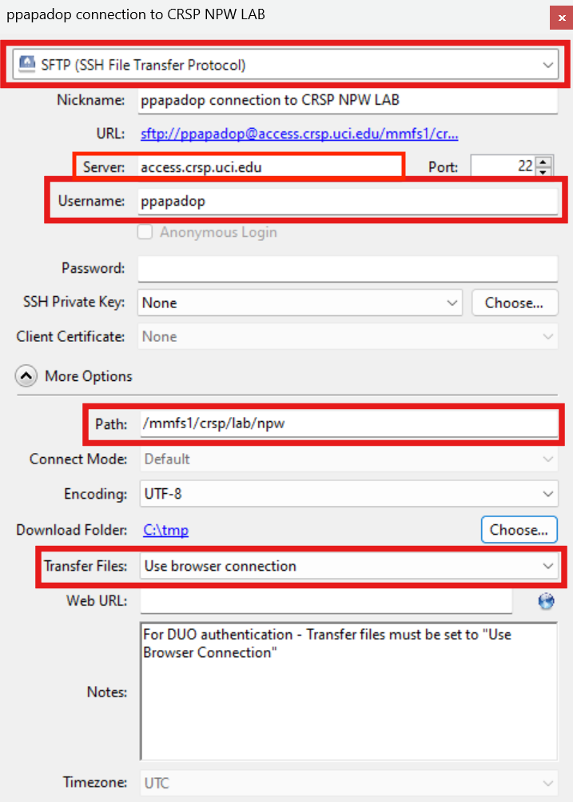
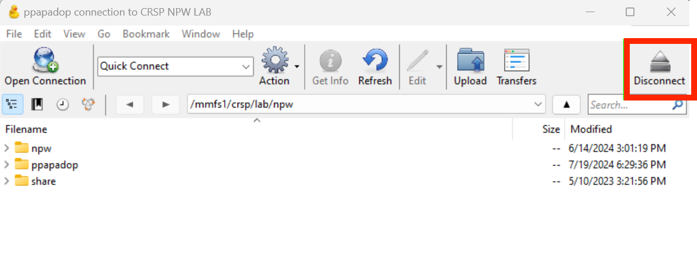
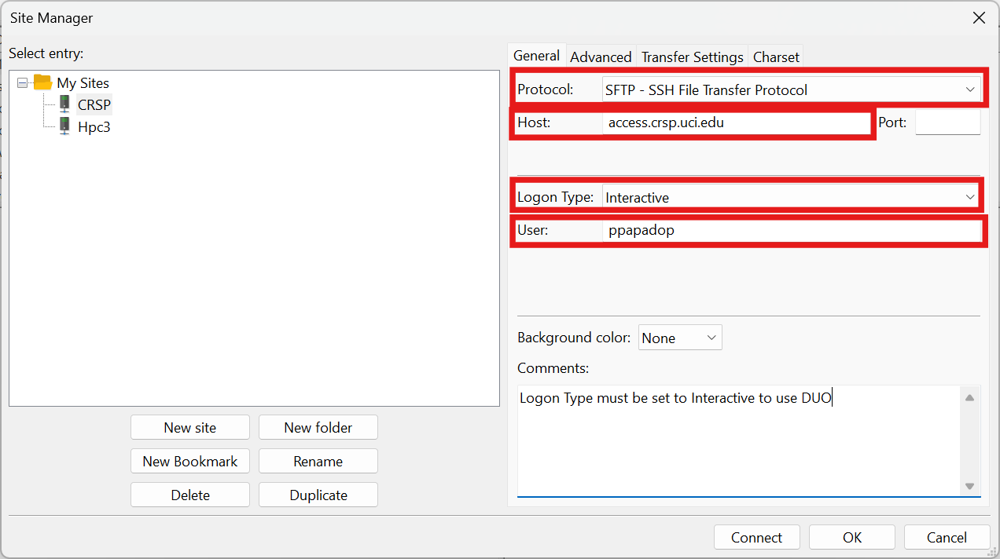
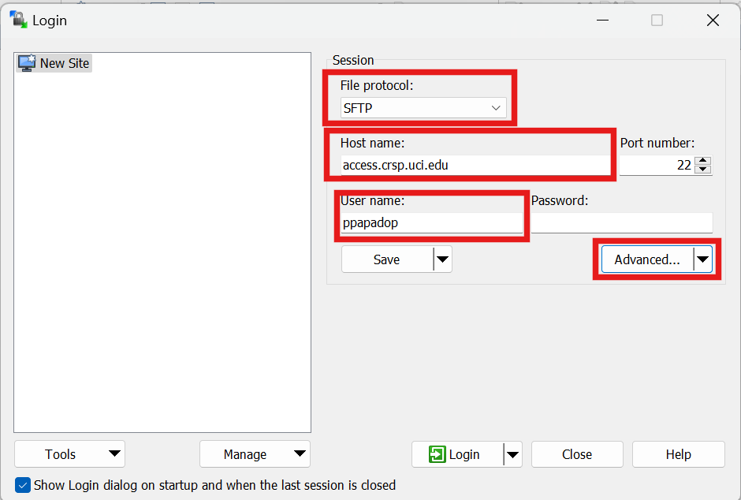
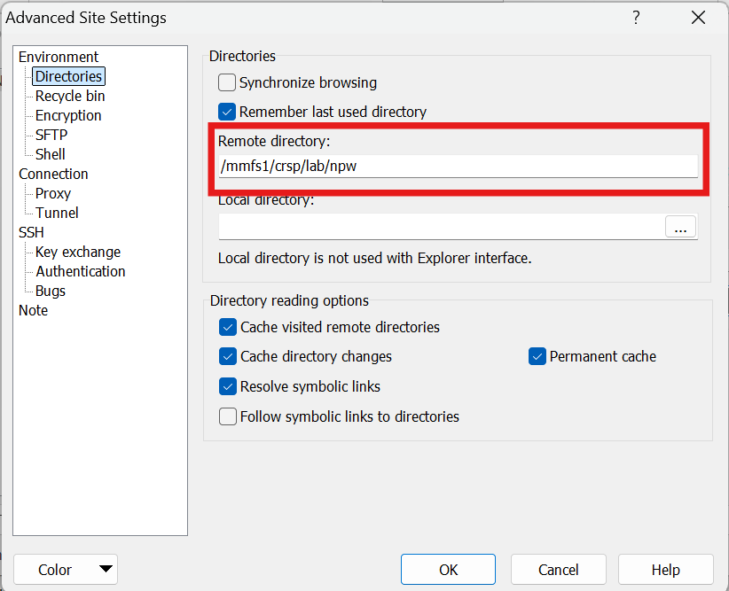

.. _unsupported clients guide:

Unsupported CRSP clients
========================

.. contents::
   :local:

RCIC does not directly support clients described here. Instead this guide has some tips and tricks
for desktop applications that people use.  This is information is provided on a best effort basis.
Some details may be missing. Use at your own risk. 

.. attention:: 
  The requirement for :ref:`DUO on CRSP <duo crsp>` usually means that these clients have some sort of 
  *special configuration option* to make CRSP usable.  You may find that  
  :ref:`creating and using SSH Key-based authentication <crsp quick start>` and configuring your client to use
  ssh keys results in smoother operation.  

.. note::

  This guide provides **NO** detail on how to configure *unsupported* clients to use SSH key-based authentication.
  From the same laptop you can securely use the same key pair for all sftp-based clients.

.. _cyberduck:

Cyberduck
---------

Cyberduck is created by the same company the brings us the CRSP Desktop. Cyberduck is available in 
App stores for both Mac and Windows. Paying for and registering Cyberduck is your responsibility.
You might choose Cyberduck because of its interface and/or explicit upload download of files.   Like the CRSP Desktop,
Cyberduck has the concept of bookmarks.  

If students are using a common computer (for example in a lab), Cyberduck
might be a very good choice where each student has its own Cyberduck bookmark allowing each one to use its own 
credentials.  In this case, it recommended to not use SSH keys and remain with the default password + DUO. 

:bluelight:`When creating Cyberduck Bookmark, the following are key configuration items`
  * Protocol: sftp
  * Server: access.crsp.uci.edu
  * Username: <UCINetID>
  * Path: /mmfs1/crsp/lab/<UCINetID of PI>
  * Transfer Files: Use Browser Connection

The last entry, **Transfer Files**,  is critical to having Cyberduck work with DUO authentication.

Here is an example Cyberduck Bookmark for the user *ppapadop* accessing the *npw* lab:

   Example Cyberduck Bookmark 

Once connected (after properly responding to DUO), a user should *explicitly disconnect*  when they are done.
This is especially important on shared computers.  Press the :guilabel:`Disconnect` icon as outlined in the following:

   Explicitly Disconnect from Cyberduck

After disconnection, you can close the cyberduck window.

.. _filezilla:

FileZilla
---------

FileZilla is another popular client that runs on Mac, Windows, and Linux. 

.. attention::
   * Filezilla is nearly unusable *without ssh key authentication*
   * To work with CRSP and Duo, :guilabel:`Logon Type` must be set to **interactive**.

Here is an example FileZilla Site configuration for the user *ppapadop* accessing the *npw* lab:

   FileZilla Configuration 

To specify the remote directory, you must click on :guilabel:`Advanced` tab
and enter info in the :guilabel:`Default remote directory` as in the following example:

.. figure:: images/unsupported/filezilla-advanced.png
   :align: center
   :width: 90%
   :alt: FileZilla Advanced Configuration 

   FileZilla Advanced Configuration

.. attention::
   For Filezilla to operate more smoothly than with DUO: 
     * Change the :guilabel:`Logon Type` to *Key File* to use an SSH key
     * In the  the :guilabel:`Transfer Settings` tab limit maximum number of connections to **1**

.. _winscp:

WinSCP
------

| WinSCP is a Windows-only client originally designed to support the SCP protocol.
| To work with CRSP, you must choose the sftp protocol

Here is an example WinSCP Site configuration for the user *ppapadop* accessing the *npw* lab:

    WinSCP Configuration 

To specify the remote directory, you must click on :guilabel:`Advanced` and then again on
:guilabel:`Advanced`.  This will allow you navigate to the :guilabel:`Environment --> Directories` entry.
You should then be able to type in the remote directory as in the following:

   WinSCP Advanced Configuration
