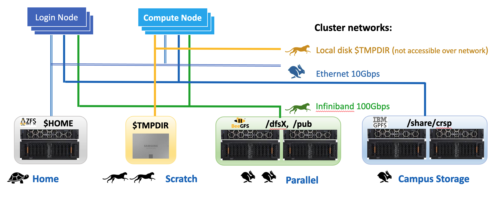

.. _storage hpc3:

Overview
=========

RCIC supports several different storage systems, each with their own *sweet spot* for 
price and performance. 
**Connectivity, file System architecture, 
and physical hardware all contribute to the performance of HPC3 storage systems**

All storage systems depicted below are available from the HPC3 cluster.  
:ref:`crsp`  (Campus Storage)  is unique  in that it can also be accessed from
desktops and laptops without going through HPC3.

   HPC3 Storage pictogram

.. attention:: | Storage is used by all users.  The nature of networked-storage
			   | :underline:`makes it possible for a single user to render a file system unusable for all`.

The following summary explains what each storage system provides,
what it should be used for, and shows links for in-depth how to use guides:

.. table:: Storage Summary
   :class: noscroll-table
   :widths: 10,24,23,43
   :align: center

   +-----------------------------------+-------------------------+------------------------------+----------------------------------------------------------------+
   |   **Name**                        | **Access**              | **Performance**              | **How to use**                                                 |
   +===================================+=========================+==============================+================================================================+
   | :ref:`HOME <home>`                | On all                  | Slowest, yet is sufficient   | Store small files, compiled binaries, order of Mbs data files. |
   |                                   | nodes via NFS mount     | when used properly           |                                                                |
   |                                   |                         |                              | :red:`Not for data intensive batch jobs`                       |
   +-----------------------------------+-------------------------+------------------------------+----------------------------------------------------------------+
   | :ref:`Scratch <scratch storage>`  | Local disk space unique | Fastest performance, data    | As scratch storage ($TMPDIR) for batch jobs that repeatedly    |
   |                                   | to each compute node    | is removed when job completes| access many small files or make frequent small reads/writes.   |
   +-----------------------------------+-------------------------+------------------------------+----------------------------------------------------------------+
   | :ref:`DFS <dfs>`                  | On all nodes            | Best for processing medium/  | To keep source code, binaries. For data used in batch jobs.    |
   |                                   | via BeegFS mount        | large data files (order of   |                                                                |
   |                                   |                         | 100's Mbs/Gbs)               | :red:`Not for writing/reading many small files`.               |
   +-----------------------------------+-------------------------+------------------------------+----------------------------------------------------------------+
   | :ref:`CRSP <crsp>`                | (1) On all nodes        | Best for processing medium/  | To keep source code, binaries. Sometimes for data used in      |
   | (campus storage)                  | via NFS mount           | large data files (order of   | batch jobs, usually better use DFS or Scratch.                 |
   |                                   | (2) From any campus IP  | 100's Mbs/Gbs)               |                                                                |
   |                                   | or VPN-connected user   |                              | :red:`Not for writing/reading many small files`.               |
   |                                   | laptop                  |                              |                                                                |
   +-----------------------------------+-------------------------+------------------------------+----------------------------------------------------------------+
   | :ref:`CRSP ANNEX <crsp annex>`    | On all nodes            | Best for processing medium/  | To keep source code, binaries. For data used in batch jobs.    |
   |                                   | via BeegFS mount        | large data files (order of   | Availalbe to a handful of labs as a temporary storage.         |
   |                                   |                         | 100's Mbs/Gbs)               |                                                                |
   |                                   |                         |                              | :red:`Not for writing/reading many small files`.               |
   +-----------------------------------+-------------------------+------------------------------+----------------------------------------------------------------+

**CRSP vs. DFS**

The two available largest capacity storage systems are :ref:`CRSP <crsp>` and :ref:`DFS <dfs>`.
Both are parallel filesystems but have different cost, availability, and usage models.
The table below highlights the key differences and similarities between these two systems
and can help you choose the right system (or combination of systems) to store your data.

.. table:: **Compare DFS and CRSP**
   :align: center
   :class: noscroll-table

   +--------------+------------------------------------------+---------------------------------------------+
   | **Feature**  | **CRSP**                                 | **DFS**                                     |
   +==============+==========================================+=============================================+
   | Access       | (1) From **any** campus IP or            |  **Only** from HPC3                         |
   |              | VPN-connected laptop                     |                                             |
   |              | (2) From HPC3                            |                                             |
   +--------------+------------------------------------------+---------------------------------------------+
   | Availability | Highly-available. No routinely planned   |  Routine maintenance outage about 4X/year.  |
   |              | outages. Can survive many types of       |  Survives disk failures (RAID) only         |
   |              | hardware failures without downtime       |                                             |
   +--------------+------------------------------------------+---------------------------------------------+
   | Backups      | Backed up daily offsite with **90 day retention**                                      |
   |              | of deleted/changed files                                                               |
   +--------------+------------------------------------------+---------------------------------------------+
   | Cost         | $50/TB/Year                              |  $100/TB/5Years                             |
   +--------------+------------------------------------------+---------------------------------------------+
   | Encryption   |  All data is encrypted at rest.          | Only **dfs3b** is encrypted at rest.        |
   | at rest      |                                          |                                             |
   +--------------+------------------------------------------+---------------------------------------------+
   | File System  | IBM Storage Scale (aka GPFS)             | BeeGFS with Thinkparq support.              |
   |              |                                          | `Details  <https://www.beegfs.io/c/>`_      |
   +--------------+------------------------------------------+---------------------------------------------+
   | Performance  | High-performance but DFS is a better     | High-performance. Most common storage for   |
   |              | match for direct use from HPC3           | used on HPC3                                |
   +--------------+------------------------------------------+---------------------------------------------+
   | Quota        | Labs have a space and file number quotas.| All users *share the same group quota*. All |
   | Management   | Users and groups can have sub-quotas     | files must be written with the same unix    |
   |              | set within the lab                       | group id to access quota space              |
   +--------------+------------------------------------------+---------------------------------------------+
   | Snapshots    | Daily file system snapshots allow users  |  No Snapshots                               |
   |              | to self-recover from deletions or        |                                             |
   |              | overwrites of files                      |                                             |
   +--------------+------------------------------------------+---------------------------------------------+
